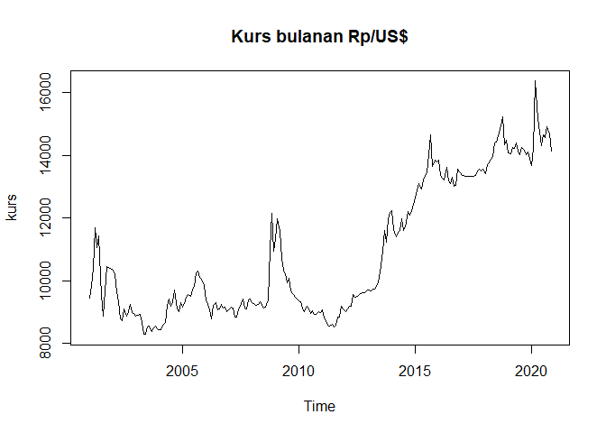
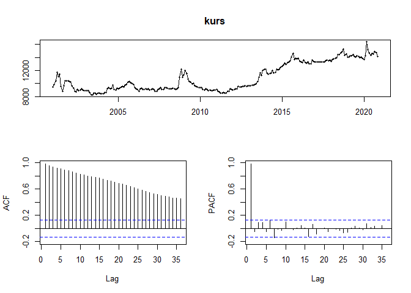
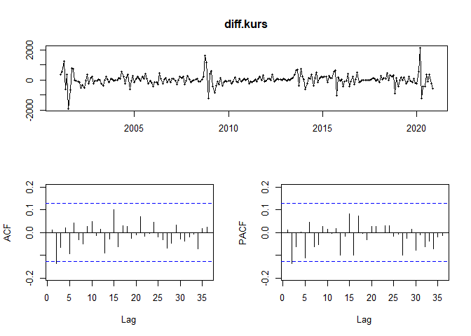
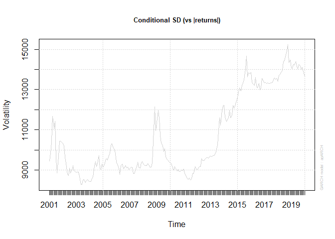
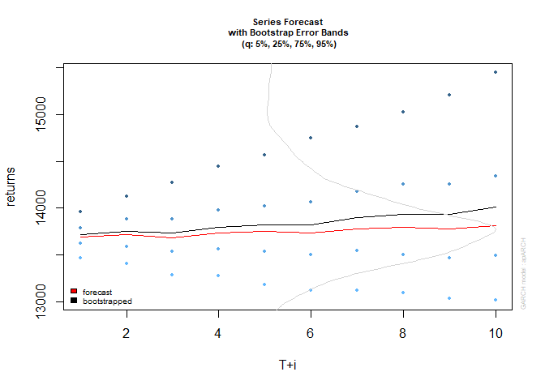

# ARCH-GARCH Modeling 


Load Library
------------

``` r
library(fpp2)
library("forecast")
library(tseries)
library(rugarch)
library(knitr)
library(MTS)
```

Load Data
---------

``` r
data<- read.csv("kursRupiah.csv", header = T)
kable(head(data, 10))
```

| Time   |    USD|
|:-------|------:|
| Jan-01 |   9450|
| Feb-01 |   9835|
| Mar-01 |  10400|
| Apr-01 |  11675|
| May-01 |  11058|
| Jun-01 |  11440|
| Jul-01 |   9525|
| Aug-01 |   8865|
| Sep-01 |   9675|
| Oct-01 |  10435|

### Plot Time Series

``` r
kurs <- ts(data$USD, start=c(2001, 1), freq=12)
plot.ts(kurs, main = "Kurs bulanan Rp/US$")
```



``` r
tsdisplay(kurs)
```



### Stasionary Test

#### Augmented Dicky Fuller Test

``` r
adf.test(kurs)
```

    ## 
    ##  Augmented Dickey-Fuller Test
    ## 
    ## data:  kurs
    ## Dickey-Fuller = -2.3717, Lag order = 6, p-value = 0.4196
    ## alternative hypothesis: stationary

#### KPSS Test

``` r
kpss.test(kurs)
```

    ## Warning in kpss.test(kurs): p-value smaller than printed p-value

    ## 
    ##  KPSS Test for Level Stationarity
    ## 
    ## data:  kurs
    ## KPSS Level = 3.6777, Truncation lag parameter = 4, p-value = 0.01

### Differencing

``` r
diff.kurs <- diff(x=kurs)
adf.test(diff.kurs) 
```

    ## Warning in adf.test(diff.kurs): p-value smaller than printed p-value

    ## 
    ##  Augmented Dickey-Fuller Test
    ## 
    ## data:  diff.kurs
    ## Dickey-Fuller = -6.5122, Lag order = 6, p-value = 0.01
    ## alternative hypothesis: stationary

``` r
kpss.test(diff.kurs) 
```

    ## Warning in kpss.test(diff.kurs): p-value greater than printed p-value

    ## 
    ##  KPSS Test for Level Stationarity
    ## 
    ## data:  diff.kurs
    ## KPSS Level = 0.0865, Truncation lag parameter = 4, p-value = 0.1

``` r
tsdisplay(diff.kurs)
```



### Auto Arima

``` r
auto.arima(kurs, approximation = FALSE, trace = TRUE)
```

    ## 
    ##  ARIMA(2,1,2)(1,0,1)[12] with drift         : 3515.795
    ##  ARIMA(0,1,0)            with drift         : 3510.24
    ##  ARIMA(1,1,0)(1,0,0)[12] with drift         : 3514.24
    ##  ARIMA(0,1,1)(0,0,1)[12] with drift         : 3514.232
    ##  ARIMA(0,1,0)                               : 3508.833
    ##  ARIMA(0,1,0)(1,0,0)[12] with drift         : 3512.221
    ##  ARIMA(0,1,0)(0,0,1)[12] with drift         : 3512.23
    ##  ARIMA(0,1,0)(1,0,1)[12] with drift         : 3514.068
    ##  ARIMA(1,1,0)            with drift         : 3512.257
    ##  ARIMA(0,1,1)            with drift         : 3512.244
    ##  ARIMA(1,1,1)            with drift         : 3510.762
    ## 
    ##  Best model: ARIMA(0,1,0)

    ## Series: kurs 
    ## ARIMA(0,1,0) 
    ## 
    ## sigma^2 estimated as 146774:  log likelihood=-1753.41
    ## AIC=3508.82   AICc=3508.83   BIC=3512.29

### Residual Check

``` r
modelKurs <- arima(kurs, order = c(0,1,0))
r = resid(modelKurs)
rr = r^2
dev.off()
```

    ## null device 
    ##           1

``` r
acf(as.vector(rr), main = "ACF residual kuadrat")
pacf(as.vector(rr), main = "PACF residual kuadrat")
```

uji efek ARCH
-------------

``` r
archTest(r)
```

    ## Q(m) of squared series(LM test):  
    ## Test statistic:  32.79969  p-value:  0.0002943196 
    ## Rank-based Test:  
    ## Test statistic:  101.9954  p-value:  0

PEMODELAN GARCH
---------------

### Model 1

``` r
model1<-ugarchspec(variance.model=list(model="sGARCH",garchOrder=c(1,1)),
                   mean.model=list(armaOrder=c(0,0)),
                   distribution.model="std")
model1Kurs <- ugarchfit(spec=model1, data=kurs)
model1Kurs
```

    ## 
    ## *---------------------------------*
    ## *          GARCH Model Fit        *
    ## *---------------------------------*
    ## 
    ## Conditional Variance Dynamics    
    ## -----------------------------------
    ## GARCH Model  : sGARCH(1,1)
    ## Mean Model   : ARFIMA(0,0,0)
    ## Distribution : std 
    ## 
    ## Optimal Parameters
    ## ------------------------------------
    ##          Estimate  Std. Error  t value Pr(>|t|)
    ## mu     9030.86168  2.3810e+01 379.2832 0.000000
    ## omega  4578.63554  2.0914e+03   2.1892 0.028579
    ## alpha1    0.77646  8.5819e-02   9.0477 0.000000
    ## beta1     0.22254  6.9708e-02   3.1924 0.001411
    ## shape    99.99999  7.1945e+01   1.3899 0.164546
    ## 
    ## Robust Standard Errors:
    ##          Estimate  Std. Error  t value Pr(>|t|)
    ## mu     9030.86168  6.2976e+01 143.4013 0.000000
    ## omega  4578.63554  2.4914e+03   1.8378 0.066091
    ## alpha1    0.77646  1.4931e-01   5.2003 0.000000
    ## beta1     0.22254  7.3885e-02   3.0119 0.002596
    ## shape    99.99999  7.4002e+01   1.3513 0.176595
    ## 
    ## LogLikelihood : -2010.873 
    ## 
    ## Information Criteria
    ## ------------------------------------
    ##                    
    ## Akaike       16.869
    ## Bayes        16.942
    ## Shibata      16.868
    ## Hannan-Quinn 16.899
    ## 
    ## Weighted Ljung-Box Test on Standardized Residuals
    ## ------------------------------------
    ##                         statistic p-value
    ## Lag[1]                      100.4       0
    ## Lag[2*(p+q)+(p+q)-1][2]     126.5       0
    ## Lag[4*(p+q)+(p+q)-1][5]     204.6       0
    ## d.o.f=0
    ## H0 : No serial correlation
    ## 
    ## Weighted Ljung-Box Test on Standardized Squared Residuals
    ## ------------------------------------
    ##                         statistic p-value
    ## Lag[1]                      5.502 0.01899
    ## Lag[2*(p+q)+(p+q)-1][5]     5.916 0.09416
    ## Lag[4*(p+q)+(p+q)-1][9]     6.414 0.25335
    ## d.o.f=2
    ## 
    ## Weighted ARCH LM Tests
    ## ------------------------------------
    ##             Statistic Shape Scale P-Value
    ## ARCH Lag[3]   0.08038 0.500 2.000  0.7768
    ## ARCH Lag[5]   0.14085 1.440 1.667  0.9787
    ## ARCH Lag[7]   0.36528 2.315 1.543  0.9889
    ## 
    ## Nyblom stability test
    ## ------------------------------------
    ## Joint Statistic:  6.813
    ## Individual Statistics:              
    ## mu     0.07067
    ## omega  2.87767
    ## alpha1 2.06341
    ## beta1  2.13029
    ## shape  0.38137
    ## 
    ## Asymptotic Critical Values (10% 5% 1%)
    ## Joint Statistic:          1.28 1.47 1.88
    ## Individual Statistic:     0.35 0.47 0.75
    ## 
    ## Sign Bias Test
    ## ------------------------------------
    ##                    t-value    prob sig
    ## Sign Bias           0.7960 0.42686    
    ## Negative Sign Bias  0.2401 0.81043    
    ## Positive Sign Bias  1.9198 0.05609   *
    ## Joint Effect        4.1994 0.24072    
    ## 
    ## 
    ## Adjusted Pearson Goodness-of-Fit Test:
    ## ------------------------------------
    ##   group statistic p-value(g-1)
    ## 1    20     464.5    1.521e-86
    ## 2    30     698.0   2.552e-128
    ## 3    40     630.1   9.430e-108
    ## 4    50     745.3   3.248e-125
    ## 
    ## 
    ## Elapsed time : 0.19751

### Model 2

``` r
model2<-ugarchspec(variance.model=list(model="sGARCH",garchOrder=c(1,1)),
                   mean.model=list(armaOrder=c(1,1)),
                   distribution.model="std")
model2Kurs <- ugarchfit(spec=model2, data=kurs)
model2Kurs 
```

    ## 
    ## *---------------------------------*
    ## *          GARCH Model Fit        *
    ## *---------------------------------*
    ## 
    ## Conditional Variance Dynamics    
    ## -----------------------------------
    ## GARCH Model  : sGARCH(1,1)
    ## Mean Model   : ARFIMA(1,0,1)
    ## Distribution : std 
    ## 
    ## Optimal Parameters
    ## ------------------------------------
    ##          Estimate  Std. Error    t value Pr(>|t|)
    ## mu     9376.81348  4.9933e+02  18.778710 0.000000
    ## ar1       1.00000  5.6650e-03 176.523575 0.000000
    ## ma1       0.00504  8.1895e-02   0.061542 0.950928
    ## omega  6777.70093  2.8073e+03   2.414331 0.015764
    ## alpha1    0.45624  1.3794e-01   3.307573 0.000941
    ## beta1     0.54276  8.6348e-02   6.285692 0.000000
    ## shape     4.18085  8.3462e-01   5.009274 0.000001
    ## 
    ## Robust Standard Errors:
    ##          Estimate  Std. Error    t value Pr(>|t|)
    ## mu     9376.81348  2.0975e+02  44.704063 0.000000
    ## ar1       1.00000  6.5340e-03 153.044838 0.000000
    ## ma1       0.00504  7.7309e-02   0.065193 0.948021
    ## omega  6777.70093  2.6676e+03   2.540789 0.011060
    ## alpha1    0.45624  1.6645e-01   2.741011 0.006125
    ## beta1     0.54276  8.3444e-02   6.504462 0.000000
    ## shape     4.18085  6.1794e-01   6.765842 0.000000
    ## 
    ## LogLikelihood : -1681.349 
    ## 
    ## Information Criteria
    ## ------------------------------------
    ##                    
    ## Akaike       14.128
    ## Bayes        14.230
    ## Shibata      14.127
    ## Hannan-Quinn 14.169
    ## 
    ## Weighted Ljung-Box Test on Standardized Residuals
    ## ------------------------------------
    ##                         statistic   p-value
    ## Lag[1]                      4.512 0.0336561
    ## Lag[2*(p+q)+(p+q)-1][5]     5.392 0.0008229
    ## Lag[4*(p+q)+(p+q)-1][9]     6.949 0.1330377
    ## d.o.f=2
    ## H0 : No serial correlation
    ## 
    ## Weighted Ljung-Box Test on Standardized Squared Residuals
    ## ------------------------------------
    ##                         statistic p-value
    ## Lag[1]                     0.2580  0.6115
    ## Lag[2*(p+q)+(p+q)-1][5]    0.5011  0.9575
    ## Lag[4*(p+q)+(p+q)-1][9]    0.8689  0.9910
    ## d.o.f=2
    ## 
    ## Weighted ARCH LM Tests
    ## ------------------------------------
    ##             Statistic Shape Scale P-Value
    ## ARCH Lag[3]    0.1727 0.500 2.000  0.6778
    ## ARCH Lag[5]    0.3615 1.440 1.667  0.9235
    ## ARCH Lag[7]    0.6076 2.315 1.543  0.9676
    ## 
    ## Nyblom stability test
    ## ------------------------------------
    ## Joint Statistic:  0.8836
    ## Individual Statistics:              
    ## mu     0.04881
    ## ar1    0.12236
    ## ma1    0.23328
    ## omega  0.20427
    ## alpha1 0.16173
    ## beta1  0.10845
    ## shape  0.05513
    ## 
    ## Asymptotic Critical Values (10% 5% 1%)
    ## Joint Statistic:          1.69 1.9 2.35
    ## Individual Statistic:     0.35 0.47 0.75
    ## 
    ## Sign Bias Test
    ## ------------------------------------
    ##                    t-value   prob sig
    ## Sign Bias           1.5052 0.1336    
    ## Negative Sign Bias  0.2073 0.8360    
    ## Positive Sign Bias  0.3127 0.7548    
    ## Joint Effect        5.0959 0.1649    
    ## 
    ## 
    ## Adjusted Pearson Goodness-of-Fit Test:
    ## ------------------------------------
    ##   group statistic p-value(g-1)
    ## 1    20     14.14       0.7756
    ## 2    30     26.73       0.5862
    ## 3    40     36.65       0.5776
    ## 4    50     58.28       0.1709
    ## 
    ## 
    ## Elapsed time : 0.1974721

### Model 3

``` r
model3<-ugarchspec(variance.model=list(model="sGARCH",garchOrder=c(1,1)),
                   mean.model=list(armaOrder=c(2,1)),
                   distribution.model="std")
model3Kurs <- ugarchfit(spec=model3, data=kurs)
model3Kurs 
```

    ## 
    ## *---------------------------------*
    ## *          GARCH Model Fit        *
    ## *---------------------------------*
    ## 
    ## Conditional Variance Dynamics    
    ## -----------------------------------
    ## GARCH Model  : sGARCH(1,1)
    ## Mean Model   : ARFIMA(2,0,1)
    ## Distribution : std 
    ## 
    ## Optimal Parameters
    ## ------------------------------------
    ##          Estimate  Std. Error  t value Pr(>|t|)
    ## mu     9525.83619  1.9759e+02  48.2107 0.000000
    ## ar1       0.43725  1.5963e-01   2.7391 0.006160
    ## ar2       0.56720  1.6021e-01   3.5403 0.000400
    ## ma1       0.64077  1.4546e-01   4.4051 0.000011
    ## omega  9278.35639  4.0439e+03   2.2944 0.021768
    ## alpha1    0.48997  1.5598e-01   3.1412 0.001682
    ## beta1     0.50903  9.7429e-02   5.2246 0.000000
    ## shape     3.90245  7.8990e-01   4.9405 0.000001
    ## 
    ## Robust Standard Errors:
    ##          Estimate  Std. Error  t value Pr(>|t|)
    ## mu     9525.83619  8.3734e+01 113.7626 0.000000
    ## ar1       0.43725  5.8557e-02   7.4671 0.000000
    ## ar2       0.56720  5.7486e-02   9.8668 0.000000
    ## ma1       0.64077  6.3480e-02  10.0941 0.000000
    ## omega  9278.35639  4.2670e+03   2.1744 0.029673
    ## alpha1    0.48997  1.8582e-01   2.6368 0.008369
    ## beta1     0.50903  9.0914e-02   5.5990 0.000000
    ## shape     3.90245  5.7782e-01   6.7538 0.000000
    ## 
    ## LogLikelihood : -1678.999 
    ## 
    ## Information Criteria
    ## ------------------------------------
    ##                    
    ## Akaike       14.117
    ## Bayes        14.234
    ## Shibata      14.115
    ## Hannan-Quinn 14.164
    ## 
    ## Weighted Ljung-Box Test on Standardized Residuals
    ## ------------------------------------
    ##                          statistic p-value
    ## Lag[1]                       1.911  0.1668
    ## Lag[2*(p+q)+(p+q)-1][8]      4.166  0.6966
    ## Lag[4*(p+q)+(p+q)-1][14]     6.565  0.6458
    ## d.o.f=3
    ## H0 : No serial correlation
    ## 
    ## Weighted Ljung-Box Test on Standardized Squared Residuals
    ## ------------------------------------
    ##                         statistic p-value
    ## Lag[1]                     0.1703  0.6798
    ## Lag[2*(p+q)+(p+q)-1][5]    0.4132  0.9702
    ## Lag[4*(p+q)+(p+q)-1][9]    0.7602  0.9941
    ## d.o.f=2
    ## 
    ## Weighted ARCH LM Tests
    ## ------------------------------------
    ##             Statistic Shape Scale P-Value
    ## ARCH Lag[3]    0.1691 0.500 2.000  0.6809
    ## ARCH Lag[5]    0.3589 1.440 1.667  0.9242
    ## ARCH Lag[7]    0.5768 2.315 1.543  0.9709
    ## 
    ## Nyblom stability test
    ## ------------------------------------
    ## Joint Statistic:  1.2011
    ## Individual Statistics:               
    ## mu     0.001599
    ## ar1    0.054517
    ## ar2    0.096988
    ## ma1    0.736537
    ## omega  0.073739
    ## alpha1 0.095542
    ## beta1  0.071527
    ## shape  0.065500
    ## 
    ## Asymptotic Critical Values (10% 5% 1%)
    ## Joint Statistic:          1.89 2.11 2.59
    ## Individual Statistic:     0.35 0.47 0.75
    ## 
    ## Sign Bias Test
    ## ------------------------------------
    ##                    t-value   prob sig
    ## Sign Bias           1.5955 0.1120    
    ## Negative Sign Bias  0.2292 0.8189    
    ## Positive Sign Bias  0.3710 0.7110    
    ## Joint Effect        5.8241 0.1205    
    ## 
    ## 
    ## Adjusted Pearson Goodness-of-Fit Test:
    ## ------------------------------------
    ##   group statistic p-value(g-1)
    ## 1    20     21.67      0.30101
    ## 2    30     28.74      0.47864
    ## 3    40     51.04      0.09378
    ## 4    50     56.19      0.22363
    ## 
    ## 
    ## Elapsed time : 0.8437092

### Model 4

``` r
model4<-ugarchspec(variance.model=list(model="sGARCH",garchOrder=c(1,1)),
                   mean.model=list(armaOrder=c(2,0)),
                   distribution.model="std")
model4Kurs <- ugarchfit(spec=model4, data=kurs)
model4Kurs 
```

    ## 
    ## *---------------------------------*
    ## *          GARCH Model Fit        *
    ## *---------------------------------*
    ## 
    ## Conditional Variance Dynamics    
    ## -----------------------------------
    ## GARCH Model  : sGARCH(1,1)
    ## Mean Model   : ARFIMA(2,0,0)
    ## Distribution : std 
    ## 
    ## Optimal Parameters
    ## ------------------------------------
    ##          Estimate  Std. Error   t value Pr(>|t|)
    ## mu     9.4923e+03  2.2139e+02 42.875369 0.000000
    ## ar1    1.0024e+00  2.7355e-02 36.645568 0.000000
    ## ar2    7.4700e-04  2.7338e-02  0.027312 0.978211
    ## omega  5.5853e+03  2.3181e+03  2.409437 0.015977
    ## alpha1 4.3596e-01  1.3039e-01  3.343470 0.000827
    ## beta1  5.6304e-01  8.3431e-02  6.748586 0.000000
    ## shape  4.1979e+00  8.0961e-01  5.185175 0.000000
    ## 
    ## Robust Standard Errors:
    ##          Estimate  Std. Error    t value Pr(>|t|)
    ## mu     9.4923e+03  9.4531e+01 100.414939 0.000000
    ## ar1    1.0024e+00  1.0115e-02  99.103269 0.000000
    ## ar2    7.4700e-04  8.6590e-03   0.086228 0.931286
    ## omega  5.5853e+03  2.0217e+03   2.762665 0.005733
    ## alpha1 4.3596e-01  1.5942e-01   2.734689 0.006244
    ## beta1  5.6304e-01  8.5296e-02   6.600979 0.000000
    ## shape  4.1979e+00  5.8638e-01   7.159070 0.000000
    ## 
    ## LogLikelihood : -1681.152 
    ## 
    ## Information Criteria
    ## ------------------------------------
    ##                    
    ## Akaike       14.127
    ## Bayes        14.229
    ## Shibata      14.125
    ## Hannan-Quinn 14.168
    ## 
    ## Weighted Ljung-Box Test on Standardized Residuals
    ## ------------------------------------
    ##                         statistic   p-value
    ## Lag[1]                      4.477 0.0343513
    ## Lag[2*(p+q)+(p+q)-1][5]     5.415 0.0007559
    ## Lag[4*(p+q)+(p+q)-1][9]     7.047 0.1235988
    ## d.o.f=2
    ## H0 : No serial correlation
    ## 
    ## Weighted Ljung-Box Test on Standardized Squared Residuals
    ## ------------------------------------
    ##                         statistic p-value
    ## Lag[1]                     0.2355  0.6274
    ## Lag[2*(p+q)+(p+q)-1][5]    0.4760  0.9613
    ## Lag[4*(p+q)+(p+q)-1][9]    0.8478  0.9917
    ## d.o.f=2
    ## 
    ## Weighted ARCH LM Tests
    ## ------------------------------------
    ##             Statistic Shape Scale P-Value
    ## ARCH Lag[3]    0.1710 0.500 2.000  0.6792
    ## ARCH Lag[5]    0.3617 1.440 1.667  0.9235
    ## ARCH Lag[7]    0.6126 2.315 1.543  0.9671
    ## 
    ## Nyblom stability test
    ## ------------------------------------
    ## Joint Statistic:  0.9617
    ## Individual Statistics:               
    ## mu     0.009545
    ## ar1    0.057892
    ## ar2    0.067737
    ## omega  0.332571
    ## alpha1 0.180514
    ## beta1  0.109143
    ## shape  0.046564
    ## 
    ## Asymptotic Critical Values (10% 5% 1%)
    ## Joint Statistic:          1.69 1.9 2.35
    ## Individual Statistic:     0.35 0.47 0.75
    ## 
    ## Sign Bias Test
    ## ------------------------------------
    ##                    t-value    prob sig
    ## Sign Bias           1.6869 0.09295   *
    ## Negative Sign Bias  0.1739 0.86207    
    ## Positive Sign Bias  0.1922 0.84773    
    ## Joint Effect        5.6871 0.12787    
    ## 
    ## 
    ## Adjusted Pearson Goodness-of-Fit Test:
    ## ------------------------------------
    ##   group statistic p-value(g-1)
    ## 1    20     18.66       0.4790
    ## 2    30     23.72       0.7426
    ## 3    40     40.67       0.3970
    ## 4    50     41.96       0.7517
    ## 
    ## 
    ## Elapsed time : 0.221441

### Model 5

``` r
model5<-ugarchspec(variance.model=list(model="sGARCH",garchOrder=c(1,1)),
                   mean.model=list(armaOrder=c(1,0)),
                   distribution.model="std")
model5Kurs <- ugarchfit(spec=model5, data=kurs)
model5Kurs 
```

    ## 
    ## *---------------------------------*
    ## *          GARCH Model Fit        *
    ## *---------------------------------*
    ## 
    ## Conditional Variance Dynamics    
    ## -----------------------------------
    ## GARCH Model  : sGARCH(1,1)
    ## Mean Model   : ARFIMA(1,0,0)
    ## Distribution : std 
    ## 
    ## Optimal Parameters
    ## ------------------------------------
    ##          Estimate  Std. Error  t value Pr(>|t|)
    ## mu     9383.31115  5.0353e+02  18.6350 0.000000
    ## ar1       1.00000  5.6020e-03 178.5114 0.000000
    ## omega  6236.10663  2.5722e+03   2.4245 0.015331
    ## alpha1    0.44743  1.3403e-01   3.3384 0.000843
    ## beta1     0.55157  8.4789e-02   6.5051 0.000000
    ## shape     4.20903  8.3094e-01   5.0654 0.000000
    ## 
    ## Robust Standard Errors:
    ##          Estimate  Std. Error  t value Pr(>|t|)
    ## mu     9383.31115  2.0149e+02  46.5697 0.000000
    ## ar1       1.00000  6.5840e-03 151.8842 0.000000
    ## omega  6236.10663  2.3408e+03   2.6641 0.007720
    ## alpha1    0.44743  1.6227e-01   2.7573 0.005828
    ## beta1     0.55157  8.3459e-02   6.6088 0.000000
    ## shape     4.20903  6.1443e-01   6.8503 0.000000
    ## 
    ## LogLikelihood : -1681.583 
    ## 
    ## Information Criteria
    ## ------------------------------------
    ##                    
    ## Akaike       14.122
    ## Bayes        14.209
    ## Shibata      14.121
    ## Hannan-Quinn 14.157
    ## 
    ## Weighted Ljung-Box Test on Standardized Residuals
    ## ------------------------------------
    ##                         statistic   p-value
    ## Lag[1]                      4.769 0.0289766
    ## Lag[2*(p+q)+(p+q)-1][2]     5.134 0.0003201
    ## Lag[4*(p+q)+(p+q)-1][5]     5.622 0.0640832
    ## d.o.f=1
    ## H0 : No serial correlation
    ## 
    ## Weighted Ljung-Box Test on Standardized Squared Residuals
    ## ------------------------------------
    ##                         statistic p-value
    ## Lag[1]                     0.2695  0.6037
    ## Lag[2*(p+q)+(p+q)-1][5]    0.5117  0.9559
    ## Lag[4*(p+q)+(p+q)-1][9]    0.8821  0.9906
    ## d.o.f=2
    ## 
    ## Weighted ARCH LM Tests
    ## ------------------------------------
    ##             Statistic Shape Scale P-Value
    ## ARCH Lag[3]    0.1730 0.500 2.000  0.6775
    ## ARCH Lag[5]    0.3594 1.440 1.667  0.9241
    ## ARCH Lag[7]    0.6072 2.315 1.543  0.9677
    ## 
    ## Nyblom stability test
    ## ------------------------------------
    ## Joint Statistic:  0.7205
    ## Individual Statistics:              
    ## mu     0.05325
    ## ar1    0.12226
    ## omega  0.25985
    ## alpha1 0.17819
    ## beta1  0.11670
    ## shape  0.05308
    ## 
    ## Asymptotic Critical Values (10% 5% 1%)
    ## Joint Statistic:          1.49 1.68 2.12
    ## Individual Statistic:     0.35 0.47 0.75
    ## 
    ## Sign Bias Test
    ## ------------------------------------
    ##                    t-value   prob sig
    ## Sign Bias           1.5043 0.1339    
    ## Negative Sign Bias  0.2162 0.8290    
    ## Positive Sign Bias  0.2886 0.7732    
    ## Joint Effect        5.0439 0.1686    
    ## 
    ## 
    ## Adjusted Pearson Goodness-of-Fit Test:
    ## ------------------------------------
    ##   group statistic p-value(g-1)
    ## 1    20     13.97       0.7854
    ## 2    30     27.49       0.5455
    ## 3    40     39.33       0.4553
    ## 4    50     52.84       0.3281
    ## 
    ## 
    ## Elapsed time : 0.185504

### Model 6

``` r
model6<-ugarchspec(variance.model=list(model="sGARCH",garchOrder=c(1,1)),
                   mean.model=list(armaOrder=c(0,1)),
                   distribution.model="std")
model6Kurs <- ugarchfit(spec=model6, data=kurs)
model6Kurs 
```

    ## 
    ## *---------------------------------*
    ## *          GARCH Model Fit        *
    ## *---------------------------------*
    ## 
    ## Conditional Variance Dynamics    
    ## -----------------------------------
    ## GARCH Model  : sGARCH(1,1)
    ## Mean Model   : ARFIMA(0,0,1)
    ## Distribution : std 
    ## 
    ## Optimal Parameters
    ## ------------------------------------
    ##          Estimate  Std. Error  t value Pr(>|t|)
    ## mu     9187.52017  4.5115e+01 203.6448 0.000000
    ## ma1       0.79449  3.0432e-02  26.1069 0.000000
    ## omega  4580.05465  2.2538e+03   2.0321 0.042141
    ## alpha1    0.47655  8.1517e-02   5.8461 0.000000
    ## beta1     0.52245  7.4741e-02   6.9901 0.000000
    ## shape    11.39120  3.4200e+00   3.3307 0.000866
    ## 
    ## Robust Standard Errors:
    ##          Estimate  Std. Error  t value Pr(>|t|)
    ## mu     9187.52017  1.0680e+02  86.0227 0.000000
    ## ma1       0.79449  2.9564e-02  26.8735 0.000000
    ## omega  4580.05465  2.3873e+03   1.9185 0.055049
    ## alpha1    0.47655  7.1927e-02   6.6255 0.000000
    ## beta1     0.52245  7.4416e-02   7.0207 0.000000
    ## shape    11.39120  6.8346e+00   1.6667 0.095577
    ## 
    ## LogLikelihood : -1910.952 
    ## 
    ## Information Criteria
    ## ------------------------------------
    ##                    
    ## Akaike       16.041
    ## Bayes        16.129
    ## Shibata      16.040
    ## Hannan-Quinn 16.077
    ## 
    ## Weighted Ljung-Box Test on Standardized Residuals
    ## ------------------------------------
    ##                         statistic   p-value
    ## Lag[1]                      43.29 4.729e-11
    ## Lag[2*(p+q)+(p+q)-1][2]     70.33 0.000e+00
    ## Lag[4*(p+q)+(p+q)-1][5]    129.22 0.000e+00
    ## d.o.f=1
    ## H0 : No serial correlation
    ## 
    ## Weighted Ljung-Box Test on Standardized Squared Residuals
    ## ------------------------------------
    ##                         statistic p-value
    ## Lag[1]                     0.1584  0.6906
    ## Lag[2*(p+q)+(p+q)-1][5]    0.2412  0.9893
    ## Lag[4*(p+q)+(p+q)-1][9]    0.4112  0.9992
    ## d.o.f=2
    ## 
    ## Weighted ARCH LM Tests
    ## ------------------------------------
    ##             Statistic Shape Scale P-Value
    ## ARCH Lag[3] 2.684e-08 0.500 2.000  0.9999
    ## ARCH Lag[5] 4.486e-02 1.440 1.667  0.9958
    ## ARCH Lag[7] 1.698e-01 2.315 1.543  0.9979
    ## 
    ## Nyblom stability test
    ## ------------------------------------
    ## Joint Statistic:  4.7717
    ## Individual Statistics:             
    ## mu     0.3402
    ## ma1    1.2600
    ## omega  0.8814
    ## alpha1 1.2271
    ## beta1  0.4905
    ## shape  0.2653
    ## 
    ## Asymptotic Critical Values (10% 5% 1%)
    ## Joint Statistic:          1.49 1.68 2.12
    ## Individual Statistic:     0.35 0.47 0.75
    ## 
    ## Sign Bias Test
    ## ------------------------------------
    ##                    t-value   prob sig
    ## Sign Bias           0.9548 0.3406    
    ## Negative Sign Bias  0.2562 0.7981    
    ## Positive Sign Bias  1.4249 0.1555    
    ## Joint Effect        2.7291 0.4353    
    ## 
    ## 
    ## Adjusted Pearson Goodness-of-Fit Test:
    ## ------------------------------------
    ##   group statistic p-value(g-1)
    ## 1    20     193.4    7.010e-31
    ## 2    30     272.0    2.627e-41
    ## 3    40     252.2    5.267e-33
    ## 4    50     257.9    3.851e-30
    ## 
    ## 
    ## Elapsed time : 0.2822449

### Model 7

``` r
model7<-ugarchspec(variance.model=list(model="sGARCH",garchOrder=c(1,1)),
                   mean.model=list(armaOrder=c(2,2)),
                   distribution.model="std")
model7Kurs <- ugarchfit(spec=model7, data=kurs)
model7Kurs 
```

    ## 
    ## *---------------------------------*
    ## *          GARCH Model Fit        *
    ## *---------------------------------*
    ## 
    ## Conditional Variance Dynamics    
    ## -----------------------------------
    ## GARCH Model  : sGARCH(1,1)
    ## Mean Model   : ARFIMA(2,0,2)
    ## Distribution : std 
    ## 
    ## Optimal Parameters
    ## ------------------------------------
    ##           Estimate  Std. Error  t value Pr(>|t|)
    ## mu     12032.86599  9.5955e+02  12.5401 0.000000
    ## ar1        0.67232  1.1917e-01   5.6417 0.000000
    ## ar2        0.32549  1.1890e-01   2.7376 0.006189
    ## ma1        0.33652  1.2783e-01   2.6326 0.008473
    ## ma2       -0.13917  5.6698e-02  -2.4547 0.014101
    ## omega   4576.14435  1.9537e+03   2.3423 0.019164
    ## alpha1     0.37893  1.1721e-01   3.2329 0.001225
    ## beta1      0.62007  7.6085e-02   8.1497 0.000000
    ## shape      3.64711  5.2125e-01   6.9968 0.000000
    ## 
    ## Robust Standard Errors:
    ##           Estimate  Std. Error  t value Pr(>|t|)
    ## mu     12032.86599  2.5319e+03   4.7526 0.000002
    ## ar1        0.67232  4.3297e-02  15.5280 0.000000
    ## ar2        0.32549  4.3389e-02   7.5017 0.000000
    ## ma1        0.33652  8.0909e-02   4.1592 0.000032
    ## ma2       -0.13917  6.2099e-02  -2.2412 0.025016
    ## omega   4576.14435  1.6380e+03   2.7938 0.005209
    ## alpha1     0.37893  1.5003e-01   2.5257 0.011546
    ## beta1      0.62007  1.0312e-01   6.0129 0.000000
    ## shape      3.64711  8.1287e-01   4.4867 0.000007
    ## 
    ## LogLikelihood : -1689.329 
    ## 
    ## Information Criteria
    ## ------------------------------------
    ##                    
    ## Akaike       14.212
    ## Bayes        14.343
    ## Shibata      14.209
    ## Hannan-Quinn 14.265
    ## 
    ## Weighted Ljung-Box Test on Standardized Residuals
    ## ------------------------------------
    ##                          statistic   p-value
    ## Lag[1]                       9.169 2.461e-03
    ## Lag[2*(p+q)+(p+q)-1][11]    11.838 9.659e-15
    ## Lag[4*(p+q)+(p+q)-1][19]    15.100 2.664e-02
    ## d.o.f=4
    ## H0 : No serial correlation
    ## 
    ## Weighted Ljung-Box Test on Standardized Squared Residuals
    ## ------------------------------------
    ##                         statistic p-value
    ## Lag[1]                      2.882 0.08958
    ## Lag[2*(p+q)+(p+q)-1][5]     3.146 0.38104
    ## Lag[4*(p+q)+(p+q)-1][9]     3.406 0.69055
    ## d.o.f=2
    ## 
    ## Weighted ARCH LM Tests
    ## ------------------------------------
    ##             Statistic Shape Scale P-Value
    ## ARCH Lag[3]    0.1885 0.500 2.000  0.6642
    ## ARCH Lag[5]    0.3382 1.440 1.667  0.9299
    ## ARCH Lag[7]    0.4600 2.315 1.543  0.9819
    ## 
    ## Nyblom stability test
    ## ------------------------------------
    ## Joint Statistic:  3.7375
    ## Individual Statistics:              
    ## mu     1.40032
    ## ar1    0.09246
    ## ar2    0.07445
    ## ma1    0.89687
    ## ma2    0.69652
    ## omega  0.37254
    ## alpha1 0.12005
    ## beta1  0.07797
    ## shape  0.14870
    ## 
    ## Asymptotic Critical Values (10% 5% 1%)
    ## Joint Statistic:          2.1 2.32 2.82
    ## Individual Statistic:     0.35 0.47 0.75
    ## 
    ## Sign Bias Test
    ## ------------------------------------
    ##                    t-value    prob sig
    ## Sign Bias           2.0561 0.04088  **
    ## Negative Sign Bias  2.1363 0.03370  **
    ## Positive Sign Bias  0.1703 0.86496    
    ## Joint Effect        7.1035 0.06867   *
    ## 
    ## 
    ## Adjusted Pearson Goodness-of-Fit Test:
    ## ------------------------------------
    ##   group statistic p-value(g-1)
    ## 1    20     15.81       0.6698
    ## 2    30     24.72       0.6925
    ## 3    40     33.30       0.7268
    ## 4    50     46.98       0.5553
    ## 
    ## 
    ## Elapsed time : 0.1446111

### Model 8

``` r
model8<-ugarchspec(variance.model=list(model="sGARCH",garchOrder=c(1,1)),
                   mean.model=list(armaOrder=c(3,3)),
                   distribution.model="std")
model8Kurs <- ugarchfit(spec=model8,  data=kurs)
model8Kurs 
```

    ## 
    ## *---------------------------------*
    ## *          GARCH Model Fit        *
    ## *---------------------------------*
    ## 
    ## Conditional Variance Dynamics    
    ## -----------------------------------
    ## GARCH Model  : sGARCH(1,1)
    ## Mean Model   : ARFIMA(3,0,3)
    ## Distribution : std 
    ## 
    ## Optimal Parameters
    ## ------------------------------------
    ##           Estimate  Std. Error    t value Pr(>|t|)
    ## mu     9833.495416  1.2929e+02   76.05936 0.000000
    ## ar1       2.534339  2.6770e-03  946.64107 0.000000
    ## ar2      -2.399369  2.6900e-03 -892.06179 0.000000
    ## ar3       0.865778  2.2690e-03  381.58786 0.000000
    ## ma1      -1.561187  7.2457e-02  -21.54650 0.000000
    ## ma2       0.920216  1.0915e-01    8.43108 0.000000
    ## ma3      -0.007115  6.3918e-02   -0.11132 0.911365
    ## omega  4974.101367  2.1167e+03    2.34990 0.018778
    ## alpha1    0.413416  1.4426e-01    2.86577 0.004160
    ## beta1     0.585584  9.1844e-02    6.37587 0.000000
    ## shape     4.039747  7.7630e-01    5.20382 0.000000
    ## 
    ## Robust Standard Errors:
    ##           Estimate  Std. Error    t value Pr(>|t|)
    ## mu     9833.495416  1.1635e+02   84.51989 0.000000
    ## ar1       2.534339  3.3630e-03  753.60041 0.000000
    ## ar2      -2.399369  3.2980e-03 -727.42472 0.000000
    ## ar3       0.865778  1.2890e-03  671.83987 0.000000
    ## ma1      -1.561187  6.6971e-02  -23.31148 0.000000
    ## ma2       0.920216  9.3931e-02    9.79669 0.000000
    ## ma3      -0.007115  5.5832e-02   -0.12744 0.898594
    ## omega  4974.101367  1.7852e+03    2.78636 0.005330
    ## alpha1    0.413416  2.1261e-01    1.94446 0.051840
    ## beta1     0.585584  1.2384e-01    4.72850 0.000002
    ## shape     4.039747  5.9803e-01    6.75512 0.000000
    ## 
    ## LogLikelihood : -1676.253 
    ## 
    ## Information Criteria
    ## ------------------------------------
    ##                    
    ## Akaike       14.119
    ## Bayes        14.279
    ## Shibata      14.115
    ## Hannan-Quinn 14.184
    ## 
    ## Weighted Ljung-Box Test on Standardized Residuals
    ## ------------------------------------
    ##                          statistic   p-value
    ## Lag[1]                       4.542 3.308e-02
    ## Lag[2*(p+q)+(p+q)-1][17]    11.437 7.163e-05
    ## Lag[4*(p+q)+(p+q)-1][29]    16.184 3.215e-01
    ## d.o.f=6
    ## H0 : No serial correlation
    ## 
    ## Weighted Ljung-Box Test on Standardized Squared Residuals
    ## ------------------------------------
    ##                         statistic p-value
    ## Lag[1]                     0.3277  0.5670
    ## Lag[2*(p+q)+(p+q)-1][5]    0.5809  0.9445
    ## Lag[4*(p+q)+(p+q)-1][9]    0.9399  0.9886
    ## d.o.f=2
    ## 
    ## Weighted ARCH LM Tests
    ## ------------------------------------
    ##             Statistic Shape Scale P-Value
    ## ARCH Lag[3]    0.1758 0.500 2.000  0.6750
    ## ARCH Lag[5]    0.3458 1.440 1.667  0.9279
    ## ARCH Lag[7]    0.5560 2.315 1.543  0.9730
    ## 
    ## Nyblom stability test
    ## ------------------------------------
    ## Joint Statistic:  1.3283
    ## Individual Statistics:               
    ## mu     0.006275
    ## ar1    0.077969
    ## ar2    0.083571
    ## ar3    0.085558
    ## ma1    0.063920
    ## ma2    0.028405
    ## ma3    0.037380
    ## omega  0.446798
    ## alpha1 0.112055
    ## beta1  0.081993
    ## shape  0.042191
    ## 
    ## Asymptotic Critical Values (10% 5% 1%)
    ## Joint Statistic:          2.49 2.75 3.27
    ## Individual Statistic:     0.35 0.47 0.75
    ## 
    ## Sign Bias Test
    ## ------------------------------------
    ##                    t-value   prob sig
    ## Sign Bias           1.3723 0.1713    
    ## Negative Sign Bias  0.2920 0.7706    
    ## Positive Sign Bias  0.4012 0.6887    
    ## Joint Effect        4.7700 0.1894    
    ## 
    ## 
    ## Adjusted Pearson Goodness-of-Fit Test:
    ## ------------------------------------
    ##   group statistic p-value(g-1)
    ## 1    20     15.64       0.6809
    ## 2    30     31.50       0.3421
    ## 3    40     32.63       0.7542
    ## 4    50     44.89       0.6403
    ## 
    ## 
    ## Elapsed time : 0.4338388

GUNAKAN MODEL apARCH
--------------------

### Model 1

``` r
model1<-ugarchspec(variance.model=list(model="apARCH",garchOrder=c(1,1)),
                   mean.model=list(armaOrder=c(0,0)),
                   distribution.model="std")
model1Kurs <- ugarchfit(spec=model1, data=kurs)
model1Kurs 
```

    ## 
    ## *---------------------------------*
    ## *          GARCH Model Fit        *
    ## *---------------------------------*
    ## 
    ## Conditional Variance Dynamics    
    ## -----------------------------------
    ## GARCH Model  : apARCH(1,1)
    ## Mean Model   : ARFIMA(0,0,0)
    ## Distribution : std 
    ## 
    ## Optimal Parameters
    ## ------------------------------------
    ##          Estimate  Std. Error    t value Pr(>|t|)
    ## mu     9124.82115  2.8126e+01 324.428628  0.00000
    ## omega  4578.08601  7.4846e+03   0.611670  0.54076
    ## alpha1    1.00000  1.3038e-01   7.670013  0.00000
    ## beta1     0.00000  2.9790e-02   0.000008  0.99999
    ## gamma1   -0.10019  8.1319e-02  -1.232022  0.21794
    ## delta     1.64733  3.0591e-01   5.384968  0.00000
    ## shape   100.00000  9.7955e+01   1.020872  0.30732
    ## 
    ## Robust Standard Errors:
    ##          Estimate  Std. Error    t value Pr(>|t|)
    ## mu     9124.82115  6.2231e+01 146.629058 0.000000
    ## omega  4578.08601  9.3492e+03   0.489677 0.624362
    ## alpha1    1.00000  1.6381e-01   6.104532 0.000000
    ## beta1     0.00000  2.1805e-02   0.000012 0.999991
    ## gamma1   -0.10019  5.1390e-02  -1.949549 0.051230
    ## delta     1.64733  3.5027e-01   4.703031 0.000003
    ## shape   100.00000  1.1122e+02   0.899138 0.368579
    ## 
    ## LogLikelihood : -1995.517 
    ## 
    ## Information Criteria
    ## ------------------------------------
    ##                    
    ## Akaike       16.757
    ## Bayes        16.859
    ## Shibata      16.756
    ## Hannan-Quinn 16.798
    ## 
    ## Weighted Ljung-Box Test on Standardized Residuals
    ## ------------------------------------
    ##                         statistic p-value
    ## Lag[1]                      114.6       0
    ## Lag[2*(p+q)+(p+q)-1][2]     149.7       0
    ## Lag[4*(p+q)+(p+q)-1][5]     255.7       0
    ## d.o.f=0
    ## H0 : No serial correlation
    ## 
    ## Weighted Ljung-Box Test on Standardized Squared Residuals
    ## ------------------------------------
    ##                         statistic p-value
    ## Lag[1]                      1.766  0.1838
    ## Lag[2*(p+q)+(p+q)-1][5]     2.331  0.5426
    ## Lag[4*(p+q)+(p+q)-1][9]     2.707  0.8062
    ## d.o.f=2
    ## 
    ## Weighted ARCH LM Tests
    ## ------------------------------------
    ##             Statistic Shape Scale P-Value
    ## ARCH Lag[3]    0.0832 0.500 2.000  0.7730
    ## ARCH Lag[5]    0.1599 1.440 1.667  0.9747
    ## ARCH Lag[7]    0.4053 2.315 1.543  0.9861
    ## 
    ## Nyblom stability test
    ## ------------------------------------
    ## Joint Statistic:  2.509
    ## Individual Statistics:              
    ## mu     0.09330
    ## omega  0.03280
    ## alpha1 0.08861
    ## beta1  0.20330
    ## gamma1 0.15533
    ## delta  0.03594
    ## shape  0.36226
    ## 
    ## Asymptotic Critical Values (10% 5% 1%)
    ## Joint Statistic:          1.69 1.9 2.35
    ## Individual Statistic:     0.35 0.47 0.75
    ## 
    ## Sign Bias Test
    ## ------------------------------------
    ##                    t-value   prob sig
    ## Sign Bias           0.8912 0.3738    
    ## Negative Sign Bias  0.1729 0.8629    
    ## Positive Sign Bias  1.2741 0.2039    
    ## Joint Effect        1.8399 0.6063    
    ## 
    ## 
    ## Adjusted Pearson Goodness-of-Fit Test:
    ## ------------------------------------
    ##   group statistic p-value(g-1)
    ## 1    20     582.5   2.471e-111
    ## 2    30     609.9   5.657e-110
    ## 3    40     606.0   7.863e-103
    ## 4    50     622.7   2.015e-100
    ## 
    ## 
    ## Elapsed time : 2.323784

### Model 2

``` r
model2<-ugarchspec(variance.model=list(model="apARCH",garchOrder=c(1,1)),
                   mean.model=list(armaOrder=c(1,1)),
                   distribution.model="std")
model2Kurs <- ugarchfit(spec=model2, data=kurs)
model2Kurs 
```

    ## 
    ## *---------------------------------*
    ## *          GARCH Model Fit        *
    ## *---------------------------------*
    ## 
    ## Conditional Variance Dynamics    
    ## -----------------------------------
    ## GARCH Model  : apARCH(1,1)
    ## Mean Model   : ARFIMA(1,0,1)
    ## Distribution : std 
    ## 
    ## Optimal Parameters
    ## ------------------------------------
    ##           Estimate  Std. Error   t value Pr(>|t|)
    ## mu     9303.144043  2.6403e+02  35.23581 0.000000
    ## ar1       1.000000  5.9520e-03 167.99826 0.000000
    ## ma1       0.083043  8.9983e-02   0.92288 0.356072
    ## omega  4553.915730  5.9896e+03   0.76030 0.447073
    ## alpha1    0.535803  2.3447e-01   2.28522 0.022300
    ## beta1     0.474841  1.2293e-01   3.86286 0.000112
    ## gamma1   -0.368898  1.7240e-01  -2.13983 0.032369
    ## delta     1.813333  2.2585e-01   8.02883 0.000000
    ## shape     3.760294  9.9392e-01   3.78331 0.000155
    ## 
    ## Robust Standard Errors:
    ##           Estimate  Std. Error   t value Pr(>|t|)
    ## mu     9303.144043  1.2771e+02  72.84368 0.000000
    ## ar1       1.000000  5.9610e-03 167.74438 0.000000
    ## ma1       0.083043  9.4097e-02   0.88252 0.377494
    ## omega  4553.915730  2.7574e+03   1.65151 0.098634
    ## alpha1    0.535803  3.2415e-01   1.65293 0.098346
    ## beta1     0.474841  1.4781e-01   3.21246 0.001316
    ## gamma1   -0.368898  2.0949e-01  -1.76094 0.078248
    ## delta     1.813333  1.3576e-01  13.35653 0.000000
    ## shape     3.760294  8.9248e-01   4.21331 0.000025
    ## 
    ## LogLikelihood : -1676.386 
    ## 
    ## Information Criteria
    ## ------------------------------------
    ##                    
    ## Akaike       14.104
    ## Bayes        14.235
    ## Shibata      14.101
    ## Hannan-Quinn 14.156
    ## 
    ## Weighted Ljung-Box Test on Standardized Residuals
    ## ------------------------------------
    ##                         statistic p-value
    ## Lag[1]                      1.926  0.1652
    ## Lag[2*(p+q)+(p+q)-1][5]     3.207  0.3483
    ## Lag[4*(p+q)+(p+q)-1][9]     5.098  0.4317
    ## d.o.f=2
    ## H0 : No serial correlation
    ## 
    ## Weighted Ljung-Box Test on Standardized Squared Residuals
    ## ------------------------------------
    ##                         statistic p-value
    ## Lag[1]                     0.3479  0.5553
    ## Lag[2*(p+q)+(p+q)-1][5]    0.8274  0.8974
    ## Lag[4*(p+q)+(p+q)-1][9]    1.3959  0.9636
    ## d.o.f=2
    ## 
    ## Weighted ARCH LM Tests
    ## ------------------------------------
    ##             Statistic Shape Scale P-Value
    ## ARCH Lag[3]    0.3963 0.500 2.000  0.5290
    ## ARCH Lag[5]    0.7534 1.440 1.667  0.8072
    ## ARCH Lag[7]    1.0820 2.315 1.543  0.8998
    ## 
    ## Nyblom stability test
    ## ------------------------------------
    ## Joint Statistic:  1.8938
    ## Individual Statistics:               
    ## mu     0.002484
    ## ar1    0.161017
    ## ma1    0.363940
    ## omega  0.145598
    ## alpha1 0.062618
    ## beta1  0.119548
    ## gamma1 0.121709
    ## delta  0.130087
    ## shape  0.102280
    ## 
    ## Asymptotic Critical Values (10% 5% 1%)
    ## Joint Statistic:          2.1 2.32 2.82
    ## Individual Statistic:     0.35 0.47 0.75
    ## 
    ## Sign Bias Test
    ## ------------------------------------
    ##                     t-value   prob sig
    ## Sign Bias          0.977774 0.3292    
    ## Negative Sign Bias 0.420842 0.6743    
    ## Positive Sign Bias 0.003973 0.9968    
    ## Joint Effect       2.414569 0.4909    
    ## 
    ## 
    ## Adjusted Pearson Goodness-of-Fit Test:
    ## ------------------------------------
    ##   group statistic p-value(g-1)
    ## 1    20     16.15       0.6475
    ## 2    30     30.50       0.3895
    ## 3    40     41.67       0.3554
    ## 4    50     52.00       0.3577
    ## 
    ## 
    ## Elapsed time : 2.23205

### Model 3

``` r
model3<-ugarchspec(variance.model=list(model="apARCH",garchOrder=c(1,1)),
                   mean.model=list(armaOrder=c(2,1)),
                   distribution.model="std")
model3Kurs <- ugarchfit(spec=model3, data=kurs)
model3Kurs 
```

    ## 
    ## *---------------------------------*
    ## *          GARCH Model Fit        *
    ## *---------------------------------*
    ## 
    ## Conditional Variance Dynamics    
    ## -----------------------------------
    ## GARCH Model  : apARCH(1,1)
    ## Mean Model   : ARFIMA(2,0,1)
    ## Distribution : std 
    ## 
    ## Optimal Parameters
    ## ------------------------------------
    ##          Estimate  Std. Error  t value Pr(>|t|)
    ## mu     9515.82566  1.5113e+02 62.96520 0.000000
    ## ar1       0.49134  3.8551e-02 12.74522 0.000000
    ## ar2       0.51211  3.8578e-02 13.27466 0.000000
    ## ma1       0.63142  3.3991e-02 18.57608 0.000000
    ## omega  4689.74106  5.7357e+03  0.81764 0.413563
    ## alpha1    0.53822  2.3749e-01  2.26625 0.023436
    ## beta1     0.46135  1.3809e-01  3.34092 0.000835
    ## gamma1   -0.41527  1.7409e-01 -2.38531 0.017065
    ## delta     1.81157  2.0784e-01  8.71612 0.000000
    ## shape     3.70372  9.3493e-01  3.96148 0.000074
    ## 
    ## Robust Standard Errors:
    ##          Estimate  Std. Error  t value Pr(>|t|)
    ## mu     9515.82566  4.9714e+01 191.4125 0.000000
    ## ar1       0.49134  6.7050e-03  73.2857 0.000000
    ## ar2       0.51211  6.6890e-03  76.5575 0.000000
    ## ma1       0.63142  4.6960e-02  13.4459 0.000000
    ## omega  4689.74106  2.6229e+03   1.7880 0.073773
    ## alpha1    0.53822  3.1857e-01   1.6895 0.091127
    ## beta1     0.46135  1.7260e-01   2.6729 0.007519
    ## gamma1   -0.41527  2.0233e-01  -2.0525 0.040124
    ## delta     1.81157  1.2737e-01  14.2226 0.000000
    ## shape     3.70372  8.0635e-01   4.5932 0.000004
    ## 
    ## LogLikelihood : -1673.802 
    ## 
    ## Information Criteria
    ## ------------------------------------
    ##                    
    ## Akaike       14.090
    ## Bayes        14.236
    ## Shibata      14.087
    ## Hannan-Quinn 14.149
    ## 
    ## Weighted Ljung-Box Test on Standardized Residuals
    ## ------------------------------------
    ##                          statistic p-value
    ## Lag[1]                       0.933  0.3341
    ## Lag[2*(p+q)+(p+q)-1][8]      3.169  0.9915
    ## Lag[4*(p+q)+(p+q)-1][14]     5.964  0.7576
    ## d.o.f=3
    ## H0 : No serial correlation
    ## 
    ## Weighted Ljung-Box Test on Standardized Squared Residuals
    ## ------------------------------------
    ##                         statistic p-value
    ## Lag[1]                     0.3350  0.5627
    ## Lag[2*(p+q)+(p+q)-1][5]    0.8588  0.8907
    ## Lag[4*(p+q)+(p+q)-1][9]    1.4172  0.9621
    ## d.o.f=2
    ## 
    ## Weighted ARCH LM Tests
    ## ------------------------------------
    ##             Statistic Shape Scale P-Value
    ## ARCH Lag[3]    0.4727 0.500 2.000  0.4917
    ## ARCH Lag[5]    0.8130 1.440 1.667  0.7891
    ## ARCH Lag[7]    1.0915 2.315 1.543  0.8982
    ## 
    ## Nyblom stability test
    ## ------------------------------------
    ## Joint Statistic:  2.6683
    ## Individual Statistics:              
    ## mu     0.00177
    ## ar1    0.09462
    ## ar2    0.17166
    ## ma1    0.95635
    ## omega  0.15353
    ## alpha1 0.05094
    ## beta1  0.11311
    ## gamma1 0.13272
    ## delta  0.13606
    ## shape  0.09106
    ## 
    ## Asymptotic Critical Values (10% 5% 1%)
    ## Joint Statistic:          2.29 2.54 3.05
    ## Individual Statistic:     0.35 0.47 0.75
    ## 
    ## Sign Bias Test
    ## ------------------------------------
    ##                    t-value   prob sig
    ## Sign Bias           0.7727 0.4405    
    ## Negative Sign Bias  0.4991 0.6182    
    ## Positive Sign Bias  0.1071 0.9148    
    ## Joint Effect        2.0036 0.5717    
    ## 
    ## 
    ## Adjusted Pearson Goodness-of-Fit Test:
    ## ------------------------------------
    ##   group statistic p-value(g-1)
    ## 1    20     30.21      0.04925
    ## 2    30     40.04      0.08332
    ## 3    40     44.68      0.24534
    ## 4    50     54.93      0.25996
    ## 
    ## 
    ## Elapsed time : 2.719729

### Model 4

``` r
model4<-ugarchspec(variance.model=list(model="apARCH",garchOrder=c(1,1)),
                   mean.model=list(armaOrder=c(1,2)),
                   distribution.model="std")
model4Kurs <- ugarchfit(spec=model4, data=kurs)
model4Kurs  
```

    ## 
    ## *---------------------------------*
    ## *          GARCH Model Fit        *
    ## *---------------------------------*
    ## 
    ## Conditional Variance Dynamics    
    ## -----------------------------------
    ## GARCH Model  : apARCH(1,1)
    ## Mean Model   : ARFIMA(1,0,2)
    ## Distribution : std 
    ## 
    ## Optimal Parameters
    ## ------------------------------------
    ##           Estimate  Std. Error   t value Pr(>|t|)
    ## mu     9442.062908  2.1783e+02  43.34513 0.000000
    ## ar1       1.000000  5.0920e-03 196.38079 0.000000
    ## ma1       0.077276  7.0015e-02   1.10371 0.269718
    ## ma2      -0.137817  5.8059e-02  -2.37375 0.017608
    ## omega  4369.386515  5.1437e+03   0.84947 0.395621
    ## alpha1    0.581962  2.4348e-01   2.39016 0.016841
    ## beta1     0.434774  1.4867e-01   2.92438 0.003451
    ## gamma1   -0.358263  1.5154e-01  -2.36411 0.018073
    ## delta     1.803146  2.0205e-01   8.92407 0.000000
    ## shape     3.869681  9.9887e-01   3.87407 0.000107
    ## 
    ## Robust Standard Errors:
    ##           Estimate  Std. Error  t value Pr(>|t|)
    ## mu     9442.062908  3.0876e+01 305.8014 0.000000
    ## ar1       1.000000  4.8510e-03 206.1521 0.000000
    ## ma1       0.077276  6.6062e-02   1.1698 0.242100
    ## ma2      -0.137817  6.7145e-02  -2.0525 0.040117
    ## omega  4369.386515  2.2273e+03   1.9618 0.049789
    ## alpha1    0.581962  3.3671e-01   1.7284 0.083924
    ## beta1     0.434774  1.8618e-01   2.3353 0.019528
    ## gamma1   -0.358263  1.8465e-01  -1.9402 0.052353
    ## delta     1.803146  1.2788e-01  14.1007 0.000000
    ## shape     3.869681  9.0015e-01   4.2989 0.000017
    ## 
    ## LogLikelihood : -1673.365 
    ## 
    ## Information Criteria
    ## ------------------------------------
    ##                    
    ## Akaike       14.087
    ## Bayes        14.232
    ## Shibata      14.083
    ## Hannan-Quinn 14.145
    ## 
    ## Weighted Ljung-Box Test on Standardized Residuals
    ## ------------------------------------
    ##                          statistic p-value
    ## Lag[1]                       2.452  0.1174
    ## Lag[2*(p+q)+(p+q)-1][8]      4.478  0.4963
    ## Lag[4*(p+q)+(p+q)-1][14]     6.762  0.6072
    ## d.o.f=3
    ## H0 : No serial correlation
    ## 
    ## Weighted Ljung-Box Test on Standardized Squared Residuals
    ## ------------------------------------
    ##                         statistic p-value
    ## Lag[1]                     0.2385  0.6253
    ## Lag[2*(p+q)+(p+q)-1][5]    0.7893  0.9052
    ## Lag[4*(p+q)+(p+q)-1][9]    1.3262  0.9685
    ## d.o.f=2
    ## 
    ## Weighted ARCH LM Tests
    ## ------------------------------------
    ##             Statistic Shape Scale P-Value
    ## ARCH Lag[3]    0.3800 0.500 2.000  0.5376
    ## ARCH Lag[5]    0.8182 1.440 1.667  0.7875
    ## ARCH Lag[7]    1.0827 2.315 1.543  0.8997
    ## 
    ## Nyblom stability test
    ## ------------------------------------
    ## Joint Statistic:  2.5984
    ## Individual Statistics:               
    ## mu     0.001627
    ## ar1    0.142266
    ## ma1    0.481321
    ## ma2    0.457349
    ## omega  0.120318
    ## alpha1 0.042915
    ## beta1  0.069630
    ## gamma1 0.116398
    ## delta  0.105432
    ## shape  0.076593
    ## 
    ## Asymptotic Critical Values (10% 5% 1%)
    ## Joint Statistic:          2.29 2.54 3.05
    ## Individual Statistic:     0.35 0.47 0.75
    ## 
    ## Sign Bias Test
    ## ------------------------------------
    ##                      t-value   prob sig
    ## Sign Bias          0.7724594 0.4406    
    ## Negative Sign Bias 0.4186114 0.6759    
    ## Positive Sign Bias 0.0008189 0.9993    
    ## Joint Effect       1.7160726 0.6334    
    ## 
    ## 
    ## Adjusted Pearson Goodness-of-Fit Test:
    ## ------------------------------------
    ##   group statistic p-value(g-1)
    ## 1    20     26.02       0.1296
    ## 2    30     29.74       0.4268
    ## 3    40     37.65       0.5313
    ## 4    50     53.68       0.2997
    ## 
    ## 
    ## Elapsed time : 2.754692

### Model 5

``` r
model5<-ugarchspec(variance.model=list(model="apARCH",garchOrder=c(1,1)),
                   mean.model=list(armaOrder=c(1,0)),
                   distribution.model="std")
model5Kurs <- ugarchfit(spec=model5, data=kurs)
model5Kurs 
```

    ## 
    ## *---------------------------------*
    ## *          GARCH Model Fit        *
    ## *---------------------------------*
    ## 
    ## Conditional Variance Dynamics    
    ## -----------------------------------
    ## GARCH Model  : apARCH(1,1)
    ## Mean Model   : ARFIMA(1,0,0)
    ## Distribution : std 
    ## 
    ## Optimal Parameters
    ## ------------------------------------
    ##          Estimate  Std. Error   t value Pr(>|t|)
    ## mu     9316.04194  3.0931e+02  30.11891 0.000000
    ## ar1       1.00000  5.5920e-03 178.83141 0.000000
    ## omega  4316.08448  5.6807e+03   0.75978 0.447385
    ## alpha1    0.53831  2.2429e-01   2.40008 0.016391
    ## beta1     0.48461  1.1529e-01   4.20346 0.000026
    ## gamma1   -0.31403  1.4340e-01  -2.18993 0.028529
    ## delta     1.81554  2.2847e-01   7.94651 0.000000
    ## shape     3.77765  9.7261e-01   3.88403 0.000103
    ## 
    ## Robust Standard Errors:
    ##          Estimate  Std. Error  t value Pr(>|t|)
    ## mu     9316.04194   167.42342  55.6436 0.000000
    ## ar1       1.00000     0.00599 166.9408 0.000000
    ## omega  4316.08448  2617.16882   1.6491 0.099118
    ## alpha1    0.53831     0.30796   1.7480 0.080470
    ## beta1     0.48461     0.13394   3.6182 0.000297
    ## gamma1   -0.31403     0.16555  -1.8968 0.057848
    ## delta     1.81554     0.13479  13.4694 0.000000
    ## shape     3.77765     0.87104   4.3369 0.000014
    ## 
    ## LogLikelihood : -1676.774 
    ## 
    ## Information Criteria
    ## ------------------------------------
    ##                    
    ## Akaike       14.099
    ## Bayes        14.215
    ## Shibata      14.096
    ## Hannan-Quinn 14.145
    ## 
    ## Weighted Ljung-Box Test on Standardized Residuals
    ## ------------------------------------
    ##                         statistic   p-value
    ## Lag[1]                      4.708 0.0300185
    ## Lag[2*(p+q)+(p+q)-1][2]     5.154 0.0003051
    ## Lag[4*(p+q)+(p+q)-1][5]     5.731 0.0584859
    ## d.o.f=1
    ## H0 : No serial correlation
    ## 
    ## Weighted Ljung-Box Test on Standardized Squared Residuals
    ## ------------------------------------
    ##                         statistic p-value
    ## Lag[1]                     0.4229  0.5155
    ## Lag[2*(p+q)+(p+q)-1][5]    0.9171  0.8781
    ## Lag[4*(p+q)+(p+q)-1][9]    1.4273  0.9613
    ## d.o.f=2
    ## 
    ## Weighted ARCH LM Tests
    ## ------------------------------------
    ##             Statistic Shape Scale P-Value
    ## ARCH Lag[3]    0.3522 0.500 2.000  0.5529
    ## ARCH Lag[5]    0.7237 1.440 1.667  0.8163
    ## ARCH Lag[7]    1.0071 2.315 1.543  0.9124
    ## 
    ## Nyblom stability test
    ## ------------------------------------
    ## Joint Statistic:  1.2927
    ## Individual Statistics:               
    ## mu     0.002909
    ## ar1    0.153405
    ## omega  0.125952
    ## alpha1 0.063950
    ## beta1  0.105235
    ## gamma1 0.097401
    ## delta  0.111415
    ## shape  0.097997
    ## 
    ## Asymptotic Critical Values (10% 5% 1%)
    ## Joint Statistic:          1.89 2.11 2.59
    ## Individual Statistic:     0.35 0.47 0.75
    ## 
    ## Sign Bias Test
    ## ------------------------------------
    ##                    t-value   prob sig
    ## Sign Bias          1.21189 0.2268    
    ## Negative Sign Bias 0.28092 0.7790    
    ## Positive Sign Bias 0.03058 0.9756    
    ## Joint Effect       3.01788 0.3889    
    ## 
    ## 
    ## Adjusted Pearson Goodness-of-Fit Test:
    ## ------------------------------------
    ##   group statistic p-value(g-1)
    ## 1    20     18.32      0.50102
    ## 2    30     40.79      0.07181
    ## 3    40     47.69      0.16015
    ## 4    50     59.12      0.15259
    ## 
    ## 
    ## Elapsed time : 7.429135

### Model 6

``` r
model6<-ugarchspec(variance.model=list(model="apARCH",garchOrder=c(1,1)),
                   mean.model=list(armaOrder=c(0,1)),
                   distribution.model="std")
model6Kurs <- ugarchfit(spec=model6, data=kurs)
model6Kurs 
```

    ## 
    ## *---------------------------------*
    ## *          GARCH Model Fit        *
    ## *---------------------------------*
    ## 
    ## Conditional Variance Dynamics    
    ## -----------------------------------
    ## GARCH Model  : apARCH(1,1)
    ## Mean Model   : ARFIMA(0,0,1)
    ## Distribution : std 
    ## 
    ## Optimal Parameters
    ## ------------------------------------
    ##          Estimate  Std. Error   t value Pr(>|t|)
    ## mu     9189.59185  4.3829e+01 209.66989 0.000000
    ## ma1       0.79246  3.1151e-02  25.43890 0.000000
    ## omega  2668.70224  7.0473e+03   0.37868 0.704922
    ## alpha1    0.55701  1.3508e-01   4.12356 0.000037
    ## beta1     0.40149  9.6643e-02   4.15432 0.000033
    ## gamma1   -0.18717  1.0347e-01  -1.80889 0.070468
    ## delta     1.68975  4.8964e-01   3.45099 0.000559
    ## shape    11.98804  4.8265e+00   2.48379 0.012999
    ## 
    ## Robust Standard Errors:
    ##          Estimate  Std. Error   t value Pr(>|t|)
    ## mu     9189.59185  9.0947e+01 101.04335 0.000000
    ## ma1       0.79246  2.8301e-02  28.00051 0.000000
    ## omega  2668.70224  4.6403e+03   0.57512 0.565211
    ## alpha1    0.55701  1.2530e-01   4.44527 0.000009
    ## beta1     0.40149  7.6401e-02   5.25501 0.000000
    ## gamma1   -0.18717  8.9271e-02  -2.09667 0.036023
    ## delta     1.68975  3.4236e-01   4.93562 0.000001
    ## shape    11.98804  8.8989e+00   1.34714 0.177934
    ## 
    ## LogLikelihood : -1905.473 
    ## 
    ## Information Criteria
    ## ------------------------------------
    ##                    
    ## Akaike       16.012
    ## Bayes        16.129
    ## Shibata      16.010
    ## Hannan-Quinn 16.059
    ## 
    ## Weighted Ljung-Box Test on Standardized Residuals
    ## ------------------------------------
    ##                         statistic   p-value
    ## Lag[1]                      50.95 9.472e-13
    ## Lag[2*(p+q)+(p+q)-1][2]     87.53 0.000e+00
    ## Lag[4*(p+q)+(p+q)-1][5]    166.90 0.000e+00
    ## d.o.f=1
    ## H0 : No serial correlation
    ## 
    ## Weighted Ljung-Box Test on Standardized Squared Residuals
    ## ------------------------------------
    ##                         statistic p-value
    ## Lag[1]                     0.0305  0.8614
    ## Lag[2*(p+q)+(p+q)-1][5]    0.1564  0.9954
    ## Lag[4*(p+q)+(p+q)-1][9]    0.4480  0.9989
    ## d.o.f=2
    ## 
    ## Weighted ARCH LM Tests
    ## ------------------------------------
    ##             Statistic Shape Scale P-Value
    ## ARCH Lag[3]  0.005394 0.500 2.000  0.9415
    ## ARCH Lag[5]  0.104676 1.440 1.667  0.9860
    ## ARCH Lag[7]  0.296500 2.315 1.543  0.9929
    ## 
    ## Nyblom stability test
    ## ------------------------------------
    ## Joint Statistic:  2.9551
    ## Individual Statistics:              
    ## mu     0.51780
    ## ma1    1.09902
    ## omega  0.03862
    ## alpha1 0.06123
    ## beta1  0.17046
    ## gamma1 0.03959
    ## delta  0.03779
    ## shape  0.24817
    ## 
    ## Asymptotic Critical Values (10% 5% 1%)
    ## Joint Statistic:          1.89 2.11 2.59
    ## Individual Statistic:     0.35 0.47 0.75
    ## 
    ## Sign Bias Test
    ## ------------------------------------
    ##                    t-value   prob sig
    ## Sign Bias          1.04622 0.2965    
    ## Negative Sign Bias 0.03968 0.9684    
    ## Positive Sign Bias 1.56664 0.1185    
    ## Joint Effect       2.83238 0.4182    
    ## 
    ## 
    ## Adjusted Pearson Goodness-of-Fit Test:
    ## ------------------------------------
    ##   group statistic p-value(g-1)
    ## 1    20     189.5    4.057e-30
    ## 2    30     199.5    2.357e-27
    ## 3    40     218.7    7.201e-27
    ## 4    50     217.3    4.665e-23
    ## 
    ## 
    ## Elapsed time : 22.57068

### Model 7

``` r
model7<-ugarchspec(variance.model=list(model="apARCH",garchOrder=c(1,1)),
                   mean.model=list(armaOrder=c(2,2)),
                   distribution.model="std")
model7Kurs <- ugarchfit(spec=model7, data=kurs)
model7Kurs 
```

    ## 
    ## *---------------------------------*
    ## *          GARCH Model Fit        *
    ## *---------------------------------*
    ## 
    ## Conditional Variance Dynamics    
    ## -----------------------------------
    ## GARCH Model  : apARCH(1,1)
    ## Mean Model   : ARFIMA(2,0,2)
    ## Distribution : std 
    ## 
    ## Optimal Parameters
    ## ------------------------------------
    ##          Estimate  Std. Error  t value Pr(>|t|)
    ## mu     9514.21207  1.6587e+02 57.36001 0.000000
    ## ar1       0.73843  3.8475e-02 19.19234 0.000000
    ## ar2       0.26441  3.8906e-02  6.79619 0.000000
    ## ma1       0.32776  6.0949e-02  5.37751 0.000000
    ## ma2      -0.11460  5.8565e-02 -1.95681 0.050370
    ## omega  4547.94592  5.2228e+03  0.87078 0.383874
    ## alpha1    0.54641  2.3372e-01  2.33789 0.019393
    ## beta1     0.46258  1.4593e-01  3.16986 0.001525
    ## gamma1   -0.36756  1.5833e-01 -2.32158 0.020256
    ## delta     1.81865  1.9883e-01  9.14671 0.000000
    ## shape     3.77072  9.3568e-01  4.02995 0.000056
    ## 
    ## Robust Standard Errors:
    ##          Estimate  Std. Error  t value Pr(>|t|)
    ## mu     9514.21207  5.2729e+01 180.4372 0.000000
    ## ar1       0.73843  8.0870e-03  91.3104 0.000000
    ## ar2       0.26441  5.0260e-03  52.6105 0.000000
    ## ma1       0.32776  6.9342e-02   4.7267 0.000002
    ## ma2      -0.11460  6.4526e-02  -1.7760 0.075725
    ## omega  4547.94592  2.4150e+03   1.8832 0.059670
    ## alpha1    0.54641  3.1737e-01   1.7217 0.085128
    ## beta1     0.46258  1.8608e-01   2.4859 0.012922
    ## gamma1   -0.36756  1.9734e-01  -1.8626 0.062522
    ## delta     1.81865  1.2039e-01  15.1058 0.000000
    ## shape     3.77072  8.1038e-01   4.6530 0.000003
    ## 
    ## LogLikelihood : -1672.71 
    ## 
    ## Information Criteria
    ## ------------------------------------
    ##                    
    ## Akaike       14.090
    ## Bayes        14.250
    ## Shibata      14.086
    ## Hannan-Quinn 14.154
    ## 
    ## Weighted Ljung-Box Test on Standardized Residuals
    ## ------------------------------------
    ##                          statistic p-value
    ## Lag[1]                       2.648  0.1037
    ## Lag[2*(p+q)+(p+q)-1][11]     6.024  0.4707
    ## Lag[4*(p+q)+(p+q)-1][19]     9.654  0.5267
    ## d.o.f=4
    ## H0 : No serial correlation
    ## 
    ## Weighted Ljung-Box Test on Standardized Squared Residuals
    ## ------------------------------------
    ##                         statistic p-value
    ## Lag[1]                     0.3302  0.5655
    ## Lag[2*(p+q)+(p+q)-1][5]    0.8546  0.8916
    ## Lag[4*(p+q)+(p+q)-1][9]    1.3617  0.9661
    ## d.o.f=2
    ## 
    ## Weighted ARCH LM Tests
    ## ------------------------------------
    ##             Statistic Shape Scale P-Value
    ## ARCH Lag[3]    0.3636 0.500 2.000  0.5465
    ## ARCH Lag[5]    0.7603 1.440 1.667  0.8051
    ## ARCH Lag[7]    0.9948 2.315 1.543  0.9144
    ## 
    ## Nyblom stability test
    ## ------------------------------------
    ## Joint Statistic:  2.8449
    ## Individual Statistics:               
    ## mu     0.002205
    ## ar1    0.093421
    ## ar2    0.127500
    ## ma1    0.824302
    ## ma2    0.478680
    ## omega  0.129066
    ## alpha1 0.046858
    ## beta1  0.087856
    ## gamma1 0.110314
    ## delta  0.112113
    ## shape  0.078692
    ## 
    ## Asymptotic Critical Values (10% 5% 1%)
    ## Joint Statistic:          2.49 2.75 3.27
    ## Individual Statistic:     0.35 0.47 0.75
    ## 
    ## Sign Bias Test
    ## ------------------------------------
    ##                     t-value   prob sig
    ## Sign Bias          1.103402 0.2710    
    ## Negative Sign Bias 0.312637 0.7548    
    ## Positive Sign Bias 0.003725 0.9970    
    ## Joint Effect       2.603958 0.4568    
    ## 
    ## 
    ## Adjusted Pearson Goodness-of-Fit Test:
    ## ------------------------------------
    ##   group statistic p-value(g-1)
    ## 1    20     14.31       0.7656
    ## 2    30     20.21       0.8864
    ## 3    40     29.28       0.8708
    ## 4    50     43.22       0.7057
    ## 
    ## 
    ## Elapsed time : 3.084718

### Model 8

``` r
model8<-ugarchspec(variance.model=list(model="apARCH",garchOrder=c(1,1)),
                   mean.model=list(armaOrder=c(3,3)),
                   distribution.model="std")
model8Kurs <- ugarchfit(spec=model8, data=kurs)
model8Kurs 
```

    ## 
    ## *---------------------------------*
    ## *          GARCH Model Fit        *
    ## *---------------------------------*
    ## 
    ## Conditional Variance Dynamics    
    ## -----------------------------------
    ## GARCH Model  : apARCH(1,1)
    ## Mean Model   : ARFIMA(3,0,3)
    ## Distribution : std 
    ## 
    ## Optimal Parameters
    ## ------------------------------------
    ##           Estimate  Std. Error   t value Pr(>|t|)
    ## mu     9518.146466  7.7249e+01 123.21360 0.000000
    ## ar1      -0.055007  3.7669e-02  -1.46030 0.144208
    ## ar2       0.132641  1.9113e-02   6.93984 0.000000
    ## ar3       0.932301  2.9366e-02  31.74803 0.000000
    ## ma1       1.169794  3.0099e-02  38.86519 0.000000
    ## ma2       1.023280  3.2591e-02  31.39780 0.000000
    ## ma3       0.082137  2.6794e-02   3.06553 0.002173
    ## omega  4610.335421  9.1696e+03   0.50279 0.615115
    ## alpha1    0.548483  2.3303e-01   2.35367 0.018589
    ## beta1     0.434988  1.2853e-01   3.38444 0.000713
    ## gamma1   -0.398426  1.6089e-01  -2.47642 0.013271
    ## delta     1.836378  3.5079e-01   5.23498 0.000000
    ## shape     4.653481  1.4514e+00   3.20610 0.001345
    ## 
    ## Robust Standard Errors:
    ##           Estimate  Std. Error  t value Pr(>|t|)
    ## mu     9518.146466  9.9641e+01 95.52472 0.000000
    ## ar1      -0.055007  7.3444e-02 -0.74897 0.453872
    ## ar2       0.132641  2.5114e-02  5.28162 0.000000
    ## ar3       0.932301  5.9017e-02 15.79715 0.000000
    ## ma1       1.169794  1.7627e-02 66.36367 0.000000
    ## ma2       1.023280  1.7385e-02 58.85950 0.000000
    ## ma3       0.082137  7.8557e-02  1.04557 0.295762
    ## omega  4610.335421  5.8012e+03  0.79471 0.426779
    ## alpha1    0.548483  3.5989e-01  1.52404 0.127500
    ## beta1     0.434988  1.8826e-01  2.31060 0.020855
    ## gamma1   -0.398426  2.2239e-01 -1.79160 0.073197
    ## delta     1.836378  2.4122e-01  7.61303 0.000000
    ## shape     4.653481  1.4382e+00  3.23561 0.001214
    ## 
    ## LogLikelihood : -1669.404 
    ## 
    ## Information Criteria
    ## ------------------------------------
    ##                    
    ## Akaike       14.079
    ## Bayes        14.268
    ## Shibata      14.073
    ## Hannan-Quinn 14.155
    ## 
    ## Weighted Ljung-Box Test on Standardized Residuals
    ## ------------------------------------
    ##                          statistic p-value
    ## Lag[1]                       1.445  0.2293
    ## Lag[2*(p+q)+(p+q)-1][17]     7.739  0.9864
    ## Lag[4*(p+q)+(p+q)-1][29]    12.109  0.8433
    ## d.o.f=6
    ## H0 : No serial correlation
    ## 
    ## Weighted Ljung-Box Test on Standardized Squared Residuals
    ## ------------------------------------
    ##                         statistic p-value
    ## Lag[1]                     0.8753  0.3495
    ## Lag[2*(p+q)+(p+q)-1][5]    1.6756  0.6967
    ## Lag[4*(p+q)+(p+q)-1][9]    2.2227  0.8768
    ## d.o.f=2
    ## 
    ## Weighted ARCH LM Tests
    ## ------------------------------------
    ##             Statistic Shape Scale P-Value
    ## ARCH Lag[3]    0.6226 0.500 2.000  0.4301
    ## ARCH Lag[5]    0.8728 1.440 1.667  0.7710
    ## ARCH Lag[7]    1.0991 2.315 1.543  0.8969
    ## 
    ## Nyblom stability test
    ## ------------------------------------
    ## Joint Statistic:  2.5718
    ## Individual Statistics:              
    ## mu     0.02938
    ## ar1    0.05634
    ## ar2    0.45755
    ## ar3    0.05950
    ## ma1    0.70091
    ## ma2    0.24276
    ## ma3    0.14374
    ## omega  0.15048
    ## alpha1 0.06853
    ## beta1  0.06864
    ## gamma1 0.12443
    ## delta  0.13938
    ## shape  0.11901
    ## 
    ## Asymptotic Critical Values (10% 5% 1%)
    ## Joint Statistic:          2.89 3.15 3.69
    ## Individual Statistic:     0.35 0.47 0.75
    ## 
    ## Sign Bias Test
    ## ------------------------------------
    ##                    t-value   prob sig
    ## Sign Bias           0.5576 0.5776    
    ## Negative Sign Bias  0.5842 0.5597    
    ## Positive Sign Bias  0.3416 0.7330    
    ## Joint Effect        1.9433 0.5843    
    ## 
    ## 
    ## Adjusted Pearson Goodness-of-Fit Test:
    ## ------------------------------------
    ##   group statistic p-value(g-1)
    ## 1    20     22.34      0.26772
    ## 2    30     40.04      0.08332
    ## 3    40     50.71      0.09921
    ## 4    50     67.49      0.04101
    ## 
    ## 
    ## Elapsed time : 5.268915

### Model 9

``` r
model9<-ugarchspec(variance.model=list(model="apARCH",garchOrder=c(1,1)),
                   mean.model=list(armaOrder=c(2,0)),
                   distribution.model="std")
model9Kurs <- ugarchfit(spec=model9,  data=kurs)
model9Kurs 
```

    ## 
    ## *---------------------------------*
    ## *          GARCH Model Fit        *
    ## *---------------------------------*
    ## 
    ## Conditional Variance Dynamics    
    ## -----------------------------------
    ## GARCH Model  : apARCH(1,1)
    ## Mean Model   : ARFIMA(2,0,0)
    ## Distribution : std 
    ## 
    ## Optimal Parameters
    ## ------------------------------------
    ##           Estimate  Std. Error  t value Pr(>|t|)
    ## mu     9507.839811  1.7399e+02 54.64617 0.000000
    ## ar1       1.052498  2.5546e-02 41.19988 0.000000
    ## ar2      -0.050198  2.5528e-02 -1.96637 0.049256
    ## omega  4565.219757  5.9342e+03  0.76931 0.441712
    ## alpha1    0.537960  2.2553e-01  2.38530 0.017065
    ## beta1     0.479536  1.1769e-01  4.07470 0.000046
    ## gamma1   -0.339203  1.5312e-01 -2.21532 0.026738
    ## delta     1.816915  2.2353e-01  8.12821 0.000000
    ## shape     3.721704  9.4673e-01  3.93112 0.000085
    ## 
    ## Robust Standard Errors:
    ##           Estimate  Std. Error  t value Pr(>|t|)
    ## mu     9507.839811  6.1753e+01 153.9653 0.000000
    ## ar1       1.052498  9.0990e-03 115.6731 0.000000
    ## ar2      -0.050198  8.9470e-03  -5.6105 0.000000
    ## omega  4565.219757  2.5409e+03   1.7967 0.072385
    ## alpha1    0.537960  3.0309e-01   1.7749 0.075913
    ## beta1     0.479536  1.3623e-01   3.5201 0.000431
    ## gamma1   -0.339203  1.7853e-01  -1.9000 0.057437
    ## delta     1.816915  1.2501e-01  14.5336 0.000000
    ## shape     3.721704  8.1877e-01   4.5455 0.000005
    ## 
    ## LogLikelihood : -1675.959 
    ## 
    ## Information Criteria
    ## ------------------------------------
    ##                    
    ## Akaike       14.100
    ## Bayes        14.231
    ## Shibata      14.097
    ## Hannan-Quinn 14.153
    ## 
    ## Weighted Ljung-Box Test on Standardized Residuals
    ## ------------------------------------
    ##                         statistic p-value
    ## Lag[1]                      2.604 0.10657
    ## Lag[2*(p+q)+(p+q)-1][5]     3.952 0.07511
    ## Lag[4*(p+q)+(p+q)-1][9]     5.897 0.27369
    ## d.o.f=2
    ## H0 : No serial correlation
    ## 
    ## Weighted Ljung-Box Test on Standardized Squared Residuals
    ## ------------------------------------
    ##                         statistic p-value
    ## Lag[1]                     0.3375  0.5613
    ## Lag[2*(p+q)+(p+q)-1][5]    0.8033  0.9023
    ## Lag[4*(p+q)+(p+q)-1][9]    1.3339  0.9680
    ## d.o.f=2
    ## 
    ## Weighted ARCH LM Tests
    ## ------------------------------------
    ##             Statistic Shape Scale P-Value
    ## ARCH Lag[3]    0.3645 0.500 2.000  0.5460
    ## ARCH Lag[5]    0.7151 1.440 1.667  0.8189
    ## ARCH Lag[7]    1.0272 2.315 1.543  0.9091
    ## 
    ## Nyblom stability test
    ## ------------------------------------
    ## Joint Statistic:  1.5082
    ## Individual Statistics:               
    ## mu     0.002956
    ## ar1    0.104655
    ## ar2    0.120391
    ## omega  0.135969
    ## alpha1 0.054236
    ## beta1  0.099178
    ## gamma1 0.126479
    ## delta  0.121412
    ## shape  0.086590
    ## 
    ## Asymptotic Critical Values (10% 5% 1%)
    ## Joint Statistic:          2.1 2.32 2.82
    ## Individual Statistic:     0.35 0.47 0.75
    ## 
    ## Sign Bias Test
    ## ------------------------------------
    ##                    t-value   prob sig
    ## Sign Bias           1.3706 0.1718    
    ## Negative Sign Bias  0.2736 0.7846    
    ## Positive Sign Bias  0.1006 0.9199    
    ## Joint Effect        3.5226 0.3178    
    ## 
    ## 
    ## Adjusted Pearson Goodness-of-Fit Test:
    ## ------------------------------------
    ##   group statistic p-value(g-1)
    ## 1    20     18.15       0.5121
    ## 2    30     29.49       0.4396
    ## 3    40     37.32       0.5467
    ## 4    50     53.26       0.3137
    ## 
    ## 
    ## Elapsed time : 2.06448

Model terpilih apARCH(1,1) ARMA(3,3)
------------------------------------

### Cek akurasi

``` r
kurs_train=ts(kurs[1:229],frequency = 12,start=c(2001,1))
kurs_test=ts(kurs[230:239],frequency = 12,start=c(2020,2))

modelGARCH<-ugarchspec(variance.model=list(model="apARCH",garchOrder=c(1,1)),
                       mean.model=list(armaOrder=c(3,3)),
                       distribution.model="std")
modelGARCHFIX <- ugarchfit(spec=modelGARCH, data=kurs_train)
```

    ## Warning in arima(data, order = c(modelinc[2], 0, modelinc[3]), include.mean =
    ## modelinc[1], : possible convergence problem: optim gave code = 1

``` r
plot(modelGARCHFIX, which = 3)
```



### Prediksi

``` r
bootp=ugarchboot(modelGARCHFIX,method=c("Partial","Full")[1],n.ahead = 10)
bootp
```

    ## 
    ## *-----------------------------------*
    ## *     GARCH Bootstrap Forecast      *
    ## *-----------------------------------*
    ## Model : apARCH
    ## n.ahead : 10
    ## Bootstrap method:  partial
    ## Date (T[0]): Jan 2020
    ## 
    ## Series (summary):
    ##        min  q.25  mean  q.75   max forecast[analytic]
    ## t+1  13252 13625 13718 13784 14807              13693
    ## t+2  13132 13591 13749 13880 16279              13716
    ## t+3  12808 13532 13737 13883 17100              13686
    ## t+4  12612 13560 13794 13975 17393              13734
    ## t+5  12508 13535 13821 14021 16893              13754
    ## t+6  12611 13499 13824 14060 17169              13732
    ## t+7  12618 13541 13899 14179 18596              13775
    ## t+8  12456 13499 13931 14250 19082              13793
    ## t+9  12393 13468 13934 14251 20139              13777
    ## t+10 12318 13494 14015 14336 24745              13817
    ## .....................
    ## 
    ## Sigma (summary):
    ##         min  q0.25   mean  q0.75     max forecast[analytic]
    ## t+1  163.63 163.63 163.63 163.63  163.63             163.63
    ## t+2  151.21 152.29 179.03 171.00  914.60             180.49
    ## t+3  143.20 149.10 188.35 193.55 1307.03             195.40
    ## t+4  138.23 148.80 201.24 207.16 1431.28             208.76
    ## t+5  135.33 148.93 205.68 214.84 1400.35             220.87
    ## t+6  133.13 150.54 210.63 222.71 1198.24             231.92
    ## t+7  132.34 153.37 221.57 234.25 1812.64             242.08
    ## t+8  132.34 154.37 228.70 235.56 1656.89             251.46
    ## t+9  133.32 154.56 237.12 253.20 1714.15             260.16
    ## t+10 133.40 152.88 238.80 252.46 1799.34             268.25
    ## .....................

``` r
plot(bootp, which=2)
```



``` r
s_f=bootp@forc@forecast$seriesFor 
s_f
```

    ##      Jan 2020
    ## T+1  13693.49
    ## T+2  13715.79
    ## T+3  13685.96
    ## T+4  13734.24
    ## T+5  13753.73
    ## T+6  13731.64
    ## T+7  13775.35
    ## T+8  13792.75
    ## T+9  13777.13
    ## T+10 13816.85

``` r
s_f1=as.vector(s_f)
s_f1
```

    ##  [1] 13693.49 13715.79 13685.96 13734.24 13753.73 13731.64 13775.35 13792.75
    ##  [9] 13777.13 13816.85

### akurasi

``` r
accuracy(s_f1, kurs_test)
```

    ##               ME     RMSE     MAE      MPE     MAPE      ACF1 Theil's U
    ## Test set 1025.91 1201.447 1025.91 6.791138 6.791138 0.0143812  1.420524
