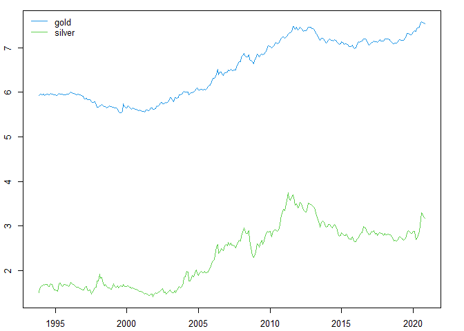
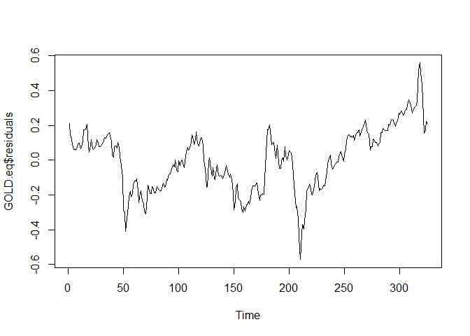

# ECM 


Load Library
------------

``` r
library(urca)
library(readxl)
library(knitr)
```

Load Data
---------

``` r
commodity_price <- read_excel("commodity_price.xlsx")
kable(head(commodity_price, 10))
```

|    GOLD|  SILVER|
|-------:|-------:|
|  373.83|  4.5332|
|  383.30|  4.9717|
|  386.88|  5.1458|
|  381.91|  5.2473|
|  384.13|  5.4350|
|  377.27|  5.3520|
|  381.43|  5.4195|
|  385.64|  5.3876|
|  385.49|  5.2823|
|  380.36|  5.1972|

``` r
GOLD <- ts(log(commodity_price$GOLD), start = c(1993, 11), frequency = 12)
SILVER <- ts(log(commodity_price$SILVER), start = c(1993, 11), frequency = 12)
par(mfrow = c(1, 1), mar = c(2.2, 2.2, 1, 2.2), cex = 0.8)
plot.ts(cbind(GOLD, SILVER), plot.type = "single", ylab = "", 
        col = 4:3)
legend("topleft", legend = c("gold", "silver"), col = 4:3, 
       lty = 1, bty = "n")
```



MENGECEK STASIONERITAS
----------------------

1.  type = trend –\> memasukkan elemen time trend ke dalam persamaan
    yang akan dicek
2.  type = drift –\> memasukkan elemen drift ke dalam persamaan
3.  type = none –\> memasukkan elemen sigma yang menunjukkan unit root

``` r
adfg1 <- ur.df(GOLD, type = "trend", selectlags = c("BIC"))
summary(adfg1) #tidak stasioner
```

    ## 
    ## ############################################### 
    ## # Augmented Dickey-Fuller Test Unit Root Test # 
    ## ############################################### 
    ## 
    ## Test regression trend 
    ## 
    ## 
    ## Call:
    ## lm(formula = z.diff ~ z.lag.1 + 1 + tt + z.diff.lag)
    ## 
    ## Residuals:
    ##       Min        1Q    Median        3Q       Max 
    ## -0.141285 -0.020032 -0.002955  0.019713  0.149788 
    ## 
    ## Coefficients:
    ##               Estimate Std. Error t value Pr(>|t|)  
    ## (Intercept)  6.539e-02  3.686e-02   1.774   0.0770 .
    ## z.lag.1     -1.186e-02  6.700e-03  -1.770   0.0777 .
    ## tt           9.834e-05  4.759e-05   2.067   0.0396 *
    ## z.diff.lag   1.339e-01  5.527e-02   2.422   0.0160 *
    ## ---
    ## Signif. codes:  0 '***' 0.001 '**' 0.01 '*' 0.05 '.' 0.1 ' ' 1
    ## 
    ## Residual standard error: 0.03508 on 319 degrees of freedom
    ## Multiple R-squared:  0.0313, Adjusted R-squared:  0.02219 
    ## F-statistic: 3.436 on 3 and 319 DF,  p-value: 0.01724
    ## 
    ## 
    ## Value of test-statistic is: -1.7698 2.9642 2.1539 
    ## 
    ## Critical values for test statistics: 
    ##       1pct  5pct 10pct
    ## tau3 -3.98 -3.42 -3.13
    ## phi2  6.15  4.71  4.05
    ## phi3  8.34  6.30  5.36

``` r
adfg1 <- ur.df(GOLD, type = "drift", selectlags = c("BIC"))
summary(adfg1) #tidak stasioner
```

    ## 
    ## ############################################### 
    ## # Augmented Dickey-Fuller Test Unit Root Test # 
    ## ############################################### 
    ## 
    ## Test regression drift 
    ## 
    ## 
    ## Call:
    ## lm(formula = z.diff ~ z.lag.1 + 1 + z.diff.lag)
    ## 
    ## Residuals:
    ##      Min       1Q   Median       3Q      Max 
    ## -0.14256 -0.01945 -0.00406  0.02060  0.15231 
    ## 
    ## Coefficients:
    ##              Estimate Std. Error t value Pr(>|t|)  
    ## (Intercept) 0.0005157  0.0194097   0.027   0.9788  
    ## z.lag.1     0.0005698  0.0029692   0.192   0.8479  
    ## z.diff.lag  0.1342006  0.0555559   2.416   0.0163 *
    ## ---
    ## Signif. codes:  0 '***' 0.001 '**' 0.01 '*' 0.05 '.' 0.1 ' ' 1
    ## 
    ## Residual standard error: 0.03525 on 320 degrees of freedom
    ## Multiple R-squared:  0.01833,    Adjusted R-squared:  0.0122 
    ## F-statistic: 2.988 on 2 and 320 DF,  p-value: 0.05178
    ## 
    ## 
    ## Value of test-statistic is: 0.1919 2.2877 
    ## 
    ## Critical values for test statistics: 
    ##       1pct  5pct 10pct
    ## tau2 -3.44 -2.87 -2.57
    ## phi1  6.47  4.61  3.79

``` r
adfg1 <- ur.df(GOLD, type = "none", selectlags = c("BIC"))
summary(adfg1) #tidak stasioner
```

    ## 
    ## ############################################### 
    ## # Augmented Dickey-Fuller Test Unit Root Test # 
    ## ############################################### 
    ## 
    ## Test regression none 
    ## 
    ## 
    ## Call:
    ## lm(formula = z.diff ~ z.lag.1 - 1 + z.diff.lag)
    ## 
    ## Residuals:
    ##       Min        1Q    Median        3Q       Max 
    ## -0.142548 -0.019480 -0.004011  0.020601  0.152386 
    ## 
    ## Coefficients:
    ##             Estimate Std. Error t value Pr(>|t|)  
    ## z.lag.1    0.0006483  0.0003026   2.142   0.0329 *
    ## z.diff.lag 0.1341103  0.0553654   2.422   0.0160 *
    ## ---
    ## Signif. codes:  0 '***' 0.001 '**' 0.01 '*' 0.05 '.' 0.1 ' ' 1
    ## 
    ## Residual standard error: 0.0352 on 321 degrees of freedom
    ## Multiple R-squared:  0.03678,    Adjusted R-squared:  0.03077 
    ## F-statistic: 6.128 on 2 and 321 DF,  p-value: 0.002445
    ## 
    ## 
    ## Value of test-statistic is: 2.1422 
    ## 
    ## Critical values for test statistics: 
    ##       1pct  5pct 10pct
    ## tau1 -2.58 -1.95 -1.62

``` r
adfg2 <- ur.df(diff(GOLD), selectlags = c("BIC"))
summary(adfg2) #sudah stasioner pada diff 1
```

    ## 
    ## ############################################### 
    ## # Augmented Dickey-Fuller Test Unit Root Test # 
    ## ############################################### 
    ## 
    ## Test regression none 
    ## 
    ## 
    ## Call:
    ## lm(formula = z.diff ~ z.lag.1 - 1 + z.diff.lag)
    ## 
    ## Residuals:
    ##      Min       1Q   Median       3Q      Max 
    ## -0.13521 -0.01523 -0.00009  0.02464  0.15533 
    ## 
    ## Coefficients:
    ##            Estimate Std. Error t value Pr(>|t|)    
    ## z.lag.1    -0.90244    0.07269 -12.416   <2e-16 ***
    ## z.diff.lag  0.06331    0.05577   1.135    0.257    
    ## ---
    ## Signif. codes:  0 '***' 0.001 '**' 0.01 '*' 0.05 '.' 0.1 ' ' 1
    ## 
    ## Residual standard error: 0.03543 on 320 degrees of freedom
    ## Multiple R-squared:  0.4265, Adjusted R-squared:  0.4229 
    ## F-statistic:   119 on 2 and 320 DF,  p-value: < 2.2e-16
    ## 
    ## 
    ## Value of test-statistic is: -12.4156 
    ## 
    ## Critical values for test statistics: 
    ##       1pct  5pct 10pct
    ## tau1 -2.58 -1.95 -1.62

``` r
adfs1 <- ur.df(SILVER, type = "trend", selectlags = c("BIC"))
summary(adfs1) #tidak stasioner
```

    ## 
    ## ############################################### 
    ## # Augmented Dickey-Fuller Test Unit Root Test # 
    ## ############################################### 
    ## 
    ## Test regression trend 
    ## 
    ## 
    ## Call:
    ## lm(formula = z.diff ~ z.lag.1 + 1 + tt + z.diff.lag)
    ## 
    ## Residuals:
    ##       Min        1Q    Median        3Q       Max 
    ## -0.224506 -0.037405 -0.001925  0.034529  0.225647 
    ## 
    ## Coefficients:
    ##               Estimate Std. Error t value Pr(>|t|)    
    ## (Intercept)  2.956e-02  1.505e-02   1.965   0.0503 .  
    ## z.lag.1     -1.939e-02  9.654e-03  -2.009   0.0454 *  
    ## tt           1.202e-04  6.853e-05   1.754   0.0804 .  
    ## z.diff.lag   2.173e-01  5.448e-02   3.989 8.25e-05 ***
    ## ---
    ## Signif. codes:  0 '***' 0.001 '**' 0.01 '*' 0.05 '.' 0.1 ' ' 1
    ## 
    ## Residual standard error: 0.06342 on 319 degrees of freedom
    ## Multiple R-squared:  0.05537,    Adjusted R-squared:  0.04649 
    ## F-statistic: 6.233 on 3 and 319 DF,  p-value: 0.0004001
    ## 
    ## 
    ## Value of test-statistic is: -2.0089 1.7374 2.028 
    ## 
    ## Critical values for test statistics: 
    ##       1pct  5pct 10pct
    ## tau3 -3.98 -3.42 -3.13
    ## phi2  6.15  4.71  4.05
    ## phi3  8.34  6.30  5.36

``` r
adfs1 <- ur.df(SILVER, type = "drift", selectlags = c("BIC"))
summary(adfs1) #tidak stasioner
```

    ## 
    ## ############################################### 
    ## # Augmented Dickey-Fuller Test Unit Root Test # 
    ## ############################################### 
    ## 
    ## Test regression drift 
    ## 
    ## 
    ## Call:
    ## lm(formula = z.diff ~ z.lag.1 + 1 + z.diff.lag)
    ## 
    ## Residuals:
    ##      Min       1Q   Median       3Q      Max 
    ## -0.22915 -0.03755 -0.00342  0.03696  0.23597 
    ## 
    ## Coefficients:
    ##              Estimate Std. Error t value Pr(>|t|)    
    ## (Intercept)  0.016146   0.012999   1.242 0.215121    
    ## z.lag.1     -0.005278   0.005349  -0.987 0.324495    
    ## z.diff.lag   0.210373   0.054513   3.859 0.000138 ***
    ## ---
    ## Signif. codes:  0 '***' 0.001 '**' 0.01 '*' 0.05 '.' 0.1 ' ' 1
    ## 
    ## Residual standard error: 0.06362 on 320 degrees of freedom
    ## Multiple R-squared:  0.04626,    Adjusted R-squared:  0.0403 
    ## F-statistic: 7.761 on 2 and 320 DF,  p-value: 0.0005112
    ## 
    ## 
    ## Value of test-statistic is: -0.9868 1.0613 
    ## 
    ## Critical values for test statistics: 
    ##       1pct  5pct 10pct
    ## tau2 -3.44 -2.87 -2.57
    ## phi1  6.47  4.61  3.79

``` r
adfs1 <- ur.df(SILVER, type = "none", selectlags = c("BIC"))
summary(adfs1) #tidak stasioner
```

    ## 
    ## ############################################### 
    ## # Augmented Dickey-Fuller Test Unit Root Test # 
    ## ############################################### 
    ## 
    ## Test regression none 
    ## 
    ## 
    ## Call:
    ## lm(formula = z.diff ~ z.lag.1 - 1 + z.diff.lag)
    ## 
    ## Residuals:
    ##       Min        1Q    Median        3Q       Max 
    ## -0.229470 -0.036591  0.000309  0.039061  0.233043 
    ## 
    ## Coefficients:
    ##            Estimate Std. Error t value Pr(>|t|)    
    ## z.lag.1    0.001113   0.001462   0.761 0.447301    
    ## z.diff.lag 0.208557   0.054539   3.824 0.000158 ***
    ## ---
    ## Signif. codes:  0 '***' 0.001 '**' 0.01 '*' 0.05 '.' 0.1 ' ' 1
    ## 
    ## Residual standard error: 0.06368 on 321 degrees of freedom
    ## Multiple R-squared:  0.04707,    Adjusted R-squared:  0.04113 
    ## F-statistic: 7.928 on 2 and 321 DF,  p-value: 0.0004358
    ## 
    ## 
    ## Value of test-statistic is: 0.7609 
    ## 
    ## Critical values for test statistics: 
    ##       1pct  5pct 10pct
    ## tau1 -2.58 -1.95 -1.62

``` r
adfs2 <- ur.df(diff(SILVER), selectlags = c("BIC"))
summary(adfs2) #sudah stasioner pada diff 1
```

    ## 
    ## ############################################### 
    ## # Augmented Dickey-Fuller Test Unit Root Test # 
    ## ############################################### 
    ## 
    ## Test regression none 
    ## 
    ## 
    ## Call:
    ## lm(formula = z.diff ~ z.lag.1 - 1 + z.diff.lag)
    ## 
    ## Residuals:
    ##       Min        1Q    Median        3Q       Max 
    ## -0.223482 -0.028255  0.002616  0.040153  0.241161 
    ## 
    ## Coefficients:
    ##            Estimate Std. Error t value Pr(>|t|)    
    ## z.lag.1    -0.86522    0.06973 -12.407   <2e-16 ***
    ## z.diff.lag  0.09728    0.05553   1.752   0.0808 .  
    ## ---
    ## Signif. codes:  0 '***' 0.001 '**' 0.01 '*' 0.05 '.' 0.1 ' ' 1
    ## 
    ## Residual standard error: 0.06352 on 320 degrees of freedom
    ## Multiple R-squared:  0.4003, Adjusted R-squared:  0.3966 
    ## F-statistic: 106.8 on 2 and 320 DF,  p-value: < 2.2e-16
    ## 
    ## 
    ## Value of test-statistic is: -12.4074 
    ## 
    ## Critical values for test statistics: 
    ##       1pct  5pct 10pct
    ## tau1 -2.58 -1.95 -1.62

MELAKUKAN LINIER MODELING
-------------------------

``` r
data<-ts.union(GOLD,SILVER)
GOLD.eq<-lm(GOLD~SILVER,data=data)
summary(GOLD.eq)
```

    ## 
    ## Call:
    ## lm(formula = GOLD ~ SILVER, data = data)
    ## 
    ## Residuals:
    ##      Min       1Q   Median       3Q      Max 
    ## -0.57179 -0.14590  0.01286  0.12494  0.55919 
    ## 
    ## Coefficients:
    ##             Estimate Std. Error t value Pr(>|t|)    
    ## (Intercept)  4.25782    0.03646  116.77   <2e-16 ***
    ## SILVER       0.96278    0.01499   64.24   <2e-16 ***
    ## ---
    ## Signif. codes:  0 '***' 0.001 '**' 0.01 '*' 0.05 '.' 0.1 ' ' 1
    ## 
    ## Residual standard error: 0.1794 on 323 degrees of freedom
    ## Multiple R-squared:  0.9274, Adjusted R-squared:  0.9272 
    ## F-statistic:  4127 on 1 and 323 DF,  p-value: < 2.2e-16

### Plot

``` r
plot.ts(GOLD.eq$residuals)
```



MELIHAT STASIONERITY DARI RESIDUAL
----------------------------------

``` r
error.GOLD <- ur.df(GOLD.eq$residuals)
summary(error.GOLD) 
```

    ## 
    ## ############################################### 
    ## # Augmented Dickey-Fuller Test Unit Root Test # 
    ## ############################################### 
    ## 
    ## Test regression none 
    ## 
    ## 
    ## Call:
    ## lm(formula = z.diff ~ z.lag.1 - 1 + z.diff.lag)
    ## 
    ## Residuals:
    ##       Min        1Q    Median        3Q       Max 
    ## -0.178566 -0.019844  0.003483  0.024390  0.179981 
    ## 
    ## Coefficients:
    ##            Estimate Std. Error t value Pr(>|t|)    
    ## z.lag.1    -0.04089    0.01389  -2.944  0.00348 ** 
    ## z.diff.lag  0.26140    0.05375   4.863 1.81e-06 ***
    ## ---
    ## Signif. codes:  0 '***' 0.001 '**' 0.01 '*' 0.05 '.' 0.1 ' ' 1
    ## 
    ## Residual standard error: 0.04421 on 321 degrees of freedom
    ## Multiple R-squared:  0.08307,    Adjusted R-squared:  0.07736 
    ## F-statistic: 14.54 on 2 and 321 DF,  p-value: 9.017e-07
    ## 
    ## 
    ## Value of test-statistic is: -2.9437 
    ## 
    ## Critical values for test statistics: 
    ##       1pct  5pct 10pct
    ## tau1 -2.58 -1.95 -1.62

Sudah stasioner. Maka dapat dikatakan bahwa GOLD dan SILVER sudah
terdapat kointegrasi pada model

``` r
error.GOLD <- ur.df(GOLD.eq$residuals)
summary(error.GOLD) #sudah stasioner
```

    ## 
    ## ############################################### 
    ## # Augmented Dickey-Fuller Test Unit Root Test # 
    ## ############################################### 
    ## 
    ## Test regression none 
    ## 
    ## 
    ## Call:
    ## lm(formula = z.diff ~ z.lag.1 - 1 + z.diff.lag)
    ## 
    ## Residuals:
    ##       Min        1Q    Median        3Q       Max 
    ## -0.178566 -0.019844  0.003483  0.024390  0.179981 
    ## 
    ## Coefficients:
    ##            Estimate Std. Error t value Pr(>|t|)    
    ## z.lag.1    -0.04089    0.01389  -2.944  0.00348 ** 
    ## z.diff.lag  0.26140    0.05375   4.863 1.81e-06 ***
    ## ---
    ## Signif. codes:  0 '***' 0.001 '**' 0.01 '*' 0.05 '.' 0.1 ' ' 1
    ## 
    ## Residual standard error: 0.04421 on 321 degrees of freedom
    ## Multiple R-squared:  0.08307,    Adjusted R-squared:  0.07736 
    ## F-statistic: 14.54 on 2 and 321 DF,  p-value: 9.017e-07
    ## 
    ## 
    ## Value of test-statistic is: -2.9437 
    ## 
    ## Critical values for test statistics: 
    ##       1pct  5pct 10pct
    ## tau1 -2.58 -1.95 -1.62

MENGKONSTRUKSI ERROR CORRECTION MODEL
-------------------------------------

``` r
GOLD.d<-diff(GOLD)[-1]
SILVER.d <- diff(SILVER)[-1]
error.ecm1 <- GOLD.eq$residuals[-1:-2]
kable(head(error.ecm1, 10))
```

|     |          x|
|:----|----------:|
| 3   |  0.1230858|
| 4   |  0.0913504|
| 5   |  0.0633087|
| 6   |  0.0601052|
| 7   |  0.0590047|
| 8   |  0.0756654|
| 9   |  0.0942802|
| 10  |  0.0965202|
| 11  |  0.0669316|
| 12  |  0.0745069|

``` r
GOLD.d1 <- diff(GOLD)[-(length(GOLD) - 1)]
SILVER.d1 <- diff(SILVER[-(length(SILVER) - 1)])
ecm.GOLD <- lm(GOLD.d ~ error.ecm1 + GOLD.d1 + SILVER.d1)
summary(ecm.GOLD)
```

    ## 
    ## Call:
    ## lm(formula = GOLD.d ~ error.ecm1 + GOLD.d1 + SILVER.d1)
    ## 
    ## Residuals:
    ##       Min        1Q    Median        3Q       Max 
    ## -0.140999 -0.019334 -0.004132  0.020095  0.152901 
    ## 
    ## Coefficients:
    ##               Estimate Std. Error t value Pr(>|t|)  
    ## (Intercept)  0.0042503  0.0019840   2.142   0.0329 *
    ## error.ecm1  -0.0003767  0.0111938  -0.034   0.9732  
    ## GOLD.d1      0.1031646  0.0768190   1.343   0.1802  
    ## SILVER.d1    0.0252508  0.0422918   0.597   0.5509  
    ## ---
    ## Signif. codes:  0 '***' 0.001 '**' 0.01 '*' 0.05 '.' 0.1 ' ' 1
    ## 
    ## Residual standard error: 0.03529 on 319 degrees of freedom
    ## Multiple R-squared:  0.01939,    Adjusted R-squared:  0.01017 
    ## F-statistic: 2.102 on 3 and 319 DF,  p-value: 0.09982

Yang diperhatikan adalah error corection term (error.ecm1) , terlihat
bahwa koefisien yang menunjukkan seberapa jauh akan kembali menuju ke
titik equilibrium jangka panjang adalah nilai yang diharapkan antara -1
sampai 0, nilai error.ecm1 sudah minus namun tidak signifikan , maka ada
indikasi terdapat granger kausality (indikasi apakah suatu peubah
mempunyai hubungan dua arah atau satu arah saja).

MENGKONSTRUKSI ERROR CORRECTION MODEL DENGAN SILVER sebagai dependent variable
------------------------------------------------------------------------------

``` r
SILVER.eq<-lm(SILVER~GOLD,data=data)
error.SILVER <- ur.df(SILVER.eq$residuals)
summary(error.SILVER)
```

    ## 
    ## ############################################### 
    ## # Augmented Dickey-Fuller Test Unit Root Test # 
    ## ############################################### 
    ## 
    ## Test regression none 
    ## 
    ## 
    ## Call:
    ## lm(formula = z.diff ~ z.lag.1 - 1 + z.diff.lag)
    ## 
    ## Residuals:
    ##       Min        1Q    Median        3Q       Max 
    ## -0.186568 -0.024780 -0.003264  0.021245  0.180003 
    ## 
    ## Coefficients:
    ##            Estimate Std. Error t value Pr(>|t|)    
    ## z.lag.1    -0.04650    0.01454  -3.198  0.00152 ** 
    ## z.diff.lag  0.26242    0.05360   4.896 1.55e-06 ***
    ## ---
    ## Signif. codes:  0 '***' 0.001 '**' 0.01 '*' 0.05 '.' 0.1 ' ' 1
    ## 
    ## Residual standard error: 0.0463 on 321 degrees of freedom
    ## Multiple R-squared:  0.08731,    Adjusted R-squared:  0.08162 
    ## F-statistic: 15.35 on 2 and 321 DF,  p-value: 4.284e-07
    ## 
    ## 
    ## Value of test-statistic is: -3.1984 
    ## 
    ## Critical values for test statistics: 
    ##       1pct  5pct 10pct
    ## tau1 -2.58 -1.95 -1.62

``` r
error.ecm2 <- SILVER.eq$residuals[-1:-2]
ecm.SILVER <- lm(SILVER.d ~ error.ecm2 + GOLD.d1 + SILVER.d1)
summary(ecm.SILVER)
```

    ## 
    ## Call:
    ## lm(formula = SILVER.d ~ error.ecm2 + GOLD.d1 + SILVER.d1)
    ## 
    ## Residuals:
    ##       Min        1Q    Median        3Q       Max 
    ## -0.223943 -0.036087 -0.004317  0.038253  0.237371 
    ## 
    ## Coefficients:
    ##              Estimate Std. Error t value Pr(>|t|)   
    ## (Intercept)  0.004287   0.003569   1.201  0.23054   
    ## error.ecm2   0.027986   0.020170   1.387  0.16626   
    ## GOLD.d1     -0.145472   0.137873  -1.055  0.29217   
    ## SILVER.d1    0.249395   0.076027   3.280  0.00115 **
    ## ---
    ## Signif. codes:  0 '***' 0.001 '**' 0.01 '*' 0.05 '.' 0.1 ' ' 1
    ## 
    ## Residual standard error: 0.06348 on 319 degrees of freedom
    ## Multiple R-squared:  0.05339,    Adjusted R-squared:  0.04449 
    ## F-statistic: 5.998 on 3 and 319 DF,  p-value: 0.0005495

Hasil menunjukkan error correction term (error.ecm2) positif dan tidak
signifikan, maka karena tidak signifikan diindikasikan bahwa hubungan
antara SILVER dan GOLD, misal digunakan SILVER sebagai dependent
variable maka GOLD tidak dapat menjelaskan keseluruhan dari proses
pembentukan harga pada SILVER, jadi data GOLD tidak cukup menjelaskan
gejolak yang terjadi pada data SILVER, mungkin dapat mencari
variabel-variabel lain atau solusi mungkin dapat mengubah time span dari
data yang digunakan. Ada beberapa kasus terkadang ketika mengubah time
span mungkin akan menghasilkan output yang berbeda. Namun misal hasil
error correction model sudah negative dan sudah signifikan maka
interpretasinya adalah untuk data ini menuju titik equilibrium jangka
panjang dibutuhkan 2% dari periode maka 2% dari bulan, sehingga dalam
kurun waktu tersebut gejolak jangka pendek akan menuju ke keseimbangan
jangka panjang.

