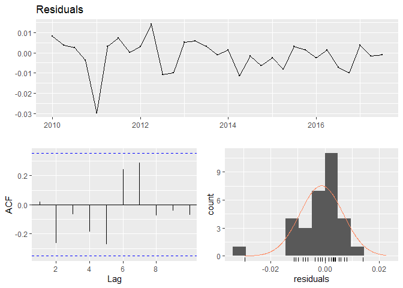

# Soal 1 UAS 2017-2018 


Load Library
------------

``` r
library(fpp2)
library("forecast")
library(tseries)
library(rugarch)
library(readxl)
library(urca)
library(knitr)
library(MTS)
```

Load Data
---------

``` r
soal1<- read_excel("timeseries_soal1.xlsx")
kable(head(soal1, 10))
```

| year   |  logpengeluaran|
|:-------|---------------:|
| 2010Q1 |        13.86017|
| 2010Q2 |        13.90189|
| 2010Q3 |        13.94033|
| 2010Q4 |        14.00461|
| 2011Q1 |        13.90467|
| 2011Q2 |        13.95056|
| 2011Q3 |        13.99599|
| 2011Q4 |        14.05510|
| 2012Q1 |        13.96086|
| 2012Q2 |        14.01792|

``` r
pengeluaran <- ts(soal1$logpengeluaran, start=c(2010), freq=4)
kable(head(pengeluaran, 10))
```

|         x|
|---------:|
|  13.86017|
|  13.90189|
|  13.94033|
|  14.00461|
|  13.90467|
|  13.95056|
|  13.99599|
|  14.05511|
|  13.96086|
|  14.01792|

Plot
----

``` r
plot.ts(pengeluaran, main = "log pengeluaran konsumsi indonesia ")
```


``` r
tsdisplay(pengeluaran) #terlihat terdapat efek seasonal
```


``` r
d.pengeluaran <- diff(pengeluaran, lag=4) #melakukan first diff seasonal
testStasioner1 <- ur.df(d.pengeluaran)
summary(testStasioner1) #tidak stasioner , dilanjutkan dengan differencing non seasonal
```

    ## 
    ## ############################################### 
    ## # Augmented Dickey-Fuller Test Unit Root Test # 
    ## ############################################### 
    ## 
    ## Test regression none 
    ## 
    ## 
    ## Call:
    ## lm(formula = z.diff ~ z.lag.1 - 1 + z.diff.lag)
    ## 
    ## Residuals:
    ##        Min         1Q     Median         3Q        Max 
    ## -0.0192379 -0.0027317  0.0003261  0.0047250  0.0135843 
    ## 
    ## Coefficients:
    ##            Estimate Std. Error t value Pr(>|t|)
    ## z.lag.1    -0.01204    0.03277  -0.367    0.717
    ## z.diff.lag -0.30691    0.19925  -1.540    0.137
    ## 
    ## Residual standard error: 0.008063 on 23 degrees of freedom
    ## Multiple R-squared:  0.1013, Adjusted R-squared:  0.02316 
    ## F-statistic: 1.296 on 2 and 23 DF,  p-value: 0.2928
    ## 
    ## 
    ## Value of test-statistic is: -0.3674 
    ## 
    ## Critical values for test statistics: 
    ##       1pct  5pct 10pct
    ## tau1 -2.62 -1.95 -1.61

``` r
dd.pengeluaran <- diff(d.pengeluaran)
testStasioner2 <- ur.df(dd.pengeluaran)
summary(testStasioner2) #sudah stasioner
```

    ## 
    ## ############################################### 
    ## # Augmented Dickey-Fuller Test Unit Root Test # 
    ## ############################################### 
    ## 
    ## Test regression none 
    ## 
    ## 
    ## Call:
    ## lm(formula = z.diff ~ z.lag.1 - 1 + z.diff.lag)
    ## 
    ## Residuals:
    ##        Min         1Q     Median         3Q        Max 
    ## -0.0172514 -0.0045702 -0.0001206  0.0044049  0.0120778 
    ## 
    ## Coefficients:
    ##            Estimate Std. Error t value Pr(>|t|)    
    ## z.lag.1     -1.6943     0.3242  -5.226 3.05e-05 ***
    ## z.diff.lag   0.2796     0.2021   1.383     0.18    
    ## ---
    ## Signif. codes:  0 '***' 0.001 '**' 0.01 '*' 0.05 '.' 0.1 ' ' 1
    ## 
    ## Residual standard error: 0.007746 on 22 degrees of freedom
    ## Multiple R-squared:  0.6949, Adjusted R-squared:  0.6671 
    ## F-statistic: 25.05 on 2 and 22 DF,  p-value: 2.133e-06
    ## 
    ## 
    ## Value of test-statistic is: -5.2261 
    ## 
    ## Critical values for test statistics: 
    ##       1pct  5pct 10pct
    ## tau1 -2.62 -1.95 -1.61

``` r
tsdisplay(dd.pengeluaran)
```


``` r
modelPengeluaran <- Arima(pengeluaran,order=c(0,1,1),seasonal=list(order=c(1,1,0),period=4),include.mean=F)
r = resid(modelPengeluaran)
checkresiduals(r)
```

    ## Warning in modeldf.default(object): Could not find appropriate degrees of
    ## freedom for this model.



Cek autokorelasi
----------------

``` r
Box.test(r, type = "Ljung-Box") 
```

    ## 
    ##  Box-Ljung test
    ## 
    ## data:  r
    ## X-squared = 0.013119, df = 1, p-value = 0.9088

uji homoskedastisitas
---------------------

``` r
archTest(r) #tidak ada efek ARCH
```

    ## Q(m) of squared series(LM test):  
    ## Test statistic:  2.362949  p-value:  0.992726 
    ## Rank-based Test:  
    ## Test statistic:  5.757867  p-value:  0.8351794

peramalan
---------

``` r
fit=Arima(pengeluaran,order=c(0,1,1), seasonal = c(1,1,0))
f = forecast:: forecast(fit, h=8)
f
```

    ##         Point Forecast    Lo 80    Hi 80    Lo 95    Hi 95
    ## 2017 Q4       14.33281 14.32127 14.34435 14.31516 14.35046
    ## 2018 Q1       14.25012 14.23803 14.26221 14.23163 14.26862
    ## 2018 Q2       14.29272 14.28010 14.30534 14.27341 14.31202
    ## 2018 Q3       14.32543 14.31231 14.33856 14.30536 14.34551
    ## 2018 Q4       14.37482 14.35857 14.39106 14.34998 14.39966
    ## 2019 Q1       14.29516 14.27801 14.31230 14.26894 14.32137
    ## 2019 Q2       14.33632 14.31832 14.35431 14.30880 14.36383
    ## 2019 Q3       14.37045 14.35164 14.38926 14.34169 14.39921

