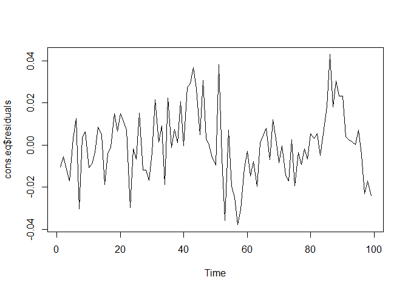
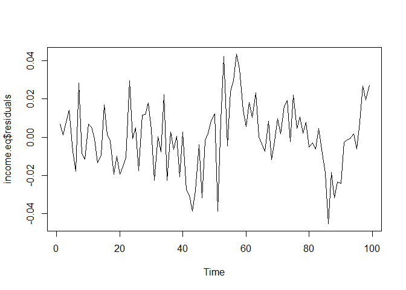
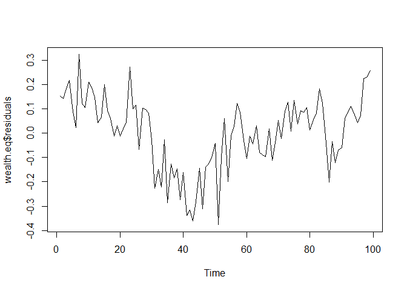

# Soal 2 UAS 2017-2018 

Load Library
------------

``` r
library(urca)
library(readxl)
library(knitr)
```


Load Data
---------

``` r
soal2<- read_excel("timeseries_soal2.xlsx")
kable(head(soal2, 10))
```

| year   |     cons|   income|   wealth|
|:-------|--------:|--------:|--------:|
| 1966Q4 |  10.4831|  10.5821|  12.9481|
| 1967Q1 |  10.4893|  10.5800|  12.9895|
| 1967Q2 |  10.5022|  10.5990|  13.0115|
| 1967Q3 |  10.5240|  10.6262|  13.0411|
| 1967Q4 |  10.5329|  10.6145|  13.0357|
| 1968Q1 |  10.5586|  10.6307|  13.0518|
| 1968Q2 |  10.5190|  10.6316|  13.0839|
| 1968Q3 |  10.5381|  10.6132|  13.1120|
| 1968Q4 |  10.5422|  10.6141|  13.1183|
| 1969Q1 |  10.5361|  10.6263|  13.1144|

``` r
cons <- ts(soal2$cons)
income <- ts(soal2$income)
wealth <- ts(soal2$wealth)
```

Cek Stasionerity level nol
--------------------------

``` r
cekCons <- ur.df(cons , type = "trend", selectlags = c("BIC"))
summary(cekCons) 
```

    ## 
    ## ############################################### 
    ## # Augmented Dickey-Fuller Test Unit Root Test # 
    ## ############################################### 
    ## 
    ## Test regression trend 
    ## 
    ## 
    ## Call:
    ## lm(formula = z.diff ~ z.lag.1 + 1 + tt + z.diff.lag)
    ## 
    ## Residuals:
    ##       Min        1Q    Median        3Q       Max 
    ## -0.041390 -0.007854  0.001202  0.007975  0.047574 
    ## 
    ## Coefficients:
    ##               Estimate Std. Error t value Pr(>|t|)
    ## (Intercept)  0.5016674  0.3593879   1.396    0.166
    ## z.lag.1     -0.0472773  0.0343087  -1.378    0.172
    ## tt           0.0003130  0.0002198   1.424    0.158
    ## z.diff.lag  -0.1001500  0.1036713  -0.966    0.337
    ## 
    ## Residual standard error: 0.0137 on 93 degrees of freedom
    ## Multiple R-squared:  0.03629,    Adjusted R-squared:  0.0052 
    ## F-statistic: 1.167 on 3 and 93 DF,  p-value: 0.3265
    ## 
    ## 
    ## Value of test-statistic is: -1.378 8.1954 1.0151 
    ## 
    ## Critical values for test statistics: 
    ##       1pct  5pct 10pct
    ## tau3 -4.04 -3.45 -3.15
    ## phi2  6.50  4.88  4.16
    ## phi3  8.73  6.49  5.47

``` r
cekCons <- ur.df(cons , type = "drift", selectlags = c("BIC"))
summary(cekCons) 
```

    ## 
    ## ############################################### 
    ## # Augmented Dickey-Fuller Test Unit Root Test # 
    ## ############################################### 
    ## 
    ## Test regression drift 
    ## 
    ## 
    ## Call:
    ## lm(formula = z.diff ~ z.lag.1 + 1 + z.diff.lag)
    ## 
    ## Residuals:
    ##       Min        1Q    Median        3Q       Max 
    ## -0.043679 -0.007093  0.001055  0.007938  0.048454 
    ## 
    ## Coefficients:
    ##               Estimate Std. Error t value Pr(>|t|)
    ## (Intercept)  0.0038899  0.0841706   0.046    0.963
    ## z.lag.1      0.0003199  0.0078044   0.041    0.967
    ## z.diff.lag  -0.1240402  0.1028634  -1.206    0.231
    ## 
    ## Residual standard error: 0.01378 on 94 degrees of freedom
    ## Multiple R-squared:  0.01527,    Adjusted R-squared:  -0.005684 
    ## F-statistic: 0.7287 on 2 and 94 DF,  p-value: 0.4852
    ## 
    ## 
    ## Value of test-statistic is: 0.041 11.1569 
    ## 
    ## Critical values for test statistics: 
    ##       1pct  5pct 10pct
    ## tau2 -3.51 -2.89 -2.58
    ## phi1  6.70  4.71  3.86

``` r
cekCons <- ur.df(cons , type = "none", selectlags = c("BIC"))
summary(cekCons) 
```

    ## 
    ## ############################################### 
    ## # Augmented Dickey-Fuller Test Unit Root Test # 
    ## ############################################### 
    ## 
    ## Test regression none 
    ## 
    ## 
    ## Call:
    ## lm(formula = z.diff ~ z.lag.1 - 1 + z.diff.lag)
    ## 
    ## Residuals:
    ##       Min        1Q    Median        3Q       Max 
    ## -0.043588 -0.007067  0.000962  0.007999  0.048462 
    ## 
    ## Coefficients:
    ##              Estimate Std. Error t value Pr(>|t|)    
    ## z.lag.1     0.0006805  0.0001433   4.749 7.24e-06 ***
    ## z.diff.lag -0.1243891  0.1020458  -1.219    0.226    
    ## ---
    ## Signif. codes:  0 '***' 0.001 '**' 0.01 '*' 0.05 '.' 0.1 ' ' 1
    ## 
    ## Residual standard error: 0.0137 on 95 degrees of freedom
    ## Multiple R-squared:  0.198,  Adjusted R-squared:  0.1811 
    ## F-statistic: 11.73 on 2 and 95 DF,  p-value: 2.812e-05
    ## 
    ## 
    ## Value of test-statistic is: 4.7485 
    ## 
    ## Critical values for test statistics: 
    ##      1pct  5pct 10pct
    ## tau1 -2.6 -1.95 -1.61

``` r
cekCons <- ur.df(diff(cons),selectlags = c("BIC"))
summary(cekCons) 
```

    ## 
    ## ############################################### 
    ## # Augmented Dickey-Fuller Test Unit Root Test # 
    ## ############################################### 
    ## 
    ## Test regression none 
    ## 
    ## 
    ## Call:
    ## lm(formula = z.diff ~ z.lag.1 - 1 + z.diff.lag)
    ## 
    ## Residuals:
    ##       Min        1Q    Median        3Q       Max 
    ## -0.047242 -0.003212  0.005220  0.013242  0.054790 
    ## 
    ## Coefficients:
    ##            Estimate Std. Error t value Pr(>|t|)    
    ## z.lag.1    -0.64494    0.13251  -4.867 4.55e-06 ***
    ## z.diff.lag -0.29724    0.09803  -3.032  0.00314 ** 
    ## ---
    ## Signif. codes:  0 '***' 0.001 '**' 0.01 '*' 0.05 '.' 0.1 ' ' 1
    ## 
    ## Residual standard error: 0.01457 on 94 degrees of freedom
    ## Multiple R-squared:  0.5081, Adjusted R-squared:  0.4976 
    ## F-statistic: 48.55 on 2 and 94 DF,  p-value: 3.296e-15
    ## 
    ## 
    ## Value of test-statistic is: -4.8671 
    ## 
    ## Critical values for test statistics: 
    ##      1pct  5pct 10pct
    ## tau1 -2.6 -1.95 -1.61

``` r
cekIncome <- ur.df(income, type = "trend", selectlags = c("BIC"))
summary(cekIncome)
```

    ## 
    ## ############################################### 
    ## # Augmented Dickey-Fuller Test Unit Root Test # 
    ## ############################################### 
    ## 
    ## Test regression trend 
    ## 
    ## 
    ## Call:
    ## lm(formula = z.diff ~ z.lag.1 + 1 + tt + z.diff.lag)
    ## 
    ## Residuals:
    ##       Min        1Q    Median        3Q       Max 
    ## -0.042055 -0.009855  0.000914  0.010164  0.056374 
    ## 
    ## Coefficients:
    ##               Estimate Std. Error t value Pr(>|t|)  
    ## (Intercept)  1.1109930  0.5475952   2.029   0.0453 *
    ## z.lag.1     -0.1043458  0.0517625  -2.016   0.0467 *
    ## tt           0.0006596  0.0003258   2.024   0.0458 *
    ## z.diff.lag  -0.1371550  0.1030505  -1.331   0.1865  
    ## ---
    ## Signif. codes:  0 '***' 0.001 '**' 0.01 '*' 0.05 '.' 0.1 ' ' 1
    ## 
    ## Residual standard error: 0.01773 on 93 degrees of freedom
    ## Multiple R-squared:  0.07723,    Adjusted R-squared:  0.04746 
    ## F-statistic: 2.594 on 3 and 93 DF,  p-value: 0.05719
    ## 
    ## 
    ## Value of test-statistic is: -2.0159 7.0818 2.0616 
    ## 
    ## Critical values for test statistics: 
    ##       1pct  5pct 10pct
    ## tau3 -4.04 -3.45 -3.15
    ## phi2  6.50  4.88  4.16
    ## phi3  8.73  6.49  5.47

``` r
cekIncome <- ur.df(income, type = "drift", selectlags = c("BIC"))
summary(cekIncome)
```

    ## 
    ## ############################################### 
    ## # Augmented Dickey-Fuller Test Unit Root Test # 
    ## ############################################### 
    ## 
    ## Test regression drift 
    ## 
    ## 
    ## Call:
    ## lm(formula = z.diff ~ z.lag.1 + 1 + z.diff.lag)
    ## 
    ## Residuals:
    ##       Min        1Q    Median        3Q       Max 
    ## -0.048016 -0.008572  0.000787  0.008549  0.055944 
    ## 
    ## Coefficients:
    ##              Estimate Std. Error t value Pr(>|t|)  
    ## (Intercept)  0.025583   0.113089   0.226   0.8215  
    ## z.lag.1     -0.001622   0.010387  -0.156   0.8762  
    ## z.diff.lag  -0.189110   0.101435  -1.864   0.0654 .
    ## ---
    ## Signif. codes:  0 '***' 0.001 '**' 0.01 '*' 0.05 '.' 0.1 ' ' 1
    ## 
    ## Residual standard error: 0.01802 on 94 degrees of freedom
    ## Multiple R-squared:  0.03656,    Adjusted R-squared:  0.01607 
    ## F-statistic: 1.784 on 2 and 94 DF,  p-value: 0.1736
    ## 
    ## 
    ## Value of test-statistic is: -0.1562 8.3001 
    ## 
    ## Critical values for test statistics: 
    ##       1pct  5pct 10pct
    ## tau2 -3.51 -2.89 -2.58
    ## phi1  6.70  4.71  3.86

``` r
cekIncome <- ur.df(income, type = "none", selectlags = c("BIC"))
summary(cekIncome)
```

    ## 
    ## ############################################### 
    ## # Augmented Dickey-Fuller Test Unit Root Test # 
    ## ############################################### 
    ## 
    ## Test regression none 
    ## 
    ## 
    ## Call:
    ## lm(formula = z.diff ~ z.lag.1 - 1 + z.diff.lag)
    ## 
    ## Residuals:
    ##       Min        1Q    Median        3Q       Max 
    ## -0.047898 -0.008666  0.000513  0.008793  0.056369 
    ## 
    ## Coefficients:
    ##              Estimate Std. Error t value Pr(>|t|)    
    ## z.lag.1     0.0007274  0.0001779   4.089 9.08e-05 ***
    ## z.diff.lag -0.1907690  0.1006629  -1.895   0.0611 .  
    ## ---
    ## Signif. codes:  0 '***' 0.001 '**' 0.01 '*' 0.05 '.' 0.1 ' ' 1
    ## 
    ## Residual standard error: 0.01793 on 95 degrees of freedom
    ## Multiple R-squared:  0.1517, Adjusted R-squared:  0.1339 
    ## F-statistic: 8.497 on 2 and 95 DF,  p-value: 0.0004027
    ## 
    ## 
    ## Value of test-statistic is: 4.0885 
    ## 
    ## Critical values for test statistics: 
    ##      1pct  5pct 10pct
    ## tau1 -2.6 -1.95 -1.61

``` r
cekIncome <- ur.df(diff(income), selectlags = c("BIC"))
summary(cekIncome)
```

    ## 
    ## ############################################### 
    ## # Augmented Dickey-Fuller Test Unit Root Test # 
    ## ############################################### 
    ## 
    ## Test regression none 
    ## 
    ## 
    ## Call:
    ## lm(formula = z.diff ~ z.lag.1 - 1 + z.diff.lag)
    ## 
    ## Residuals:
    ##       Min        1Q    Median        3Q       Max 
    ## -0.043349 -0.004420  0.005728  0.012671  0.058739 
    ## 
    ## Coefficients:
    ##            Estimate Std. Error t value Pr(>|t|)    
    ## z.lag.1     -0.8482     0.1461  -5.806 8.63e-08 ***
    ## z.diff.lag  -0.1918     0.1012  -1.896    0.061 .  
    ## ---
    ## Signif. codes:  0 '***' 0.001 '**' 0.01 '*' 0.05 '.' 0.1 ' ' 1
    ## 
    ## Residual standard error: 0.01909 on 94 degrees of freedom
    ## Multiple R-squared:  0.5439, Adjusted R-squared:  0.5342 
    ## F-statistic: 56.04 on 2 and 94 DF,  p-value: < 2.2e-16
    ## 
    ## 
    ## Value of test-statistic is: -5.806 
    ## 
    ## Critical values for test statistics: 
    ##      1pct  5pct 10pct
    ## tau1 -2.6 -1.95 -1.61

``` r
cekWealth <- ur.df(wealth, type = "trend", selectlags = c("BIC"))
summary(cekWealth)
```

    ## 
    ## ############################################### 
    ## # Augmented Dickey-Fuller Test Unit Root Test # 
    ## ############################################### 
    ## 
    ## Test regression trend 
    ## 
    ## 
    ## Call:
    ## lm(formula = z.diff ~ z.lag.1 + 1 + tt + z.diff.lag)
    ## 
    ## Residuals:
    ##      Min       1Q   Median       3Q      Max 
    ## -0.16349 -0.02124  0.00794  0.02984  0.07657 
    ## 
    ## Coefficients:
    ##               Estimate Std. Error t value Pr(>|t|)  
    ## (Intercept)  0.2403229  0.2426179   0.991   0.3245  
    ## z.lag.1     -0.0192656  0.0189755  -1.015   0.3126  
    ## tt           0.0003796  0.0002028   1.872   0.0643 .
    ## z.diff.lag   0.1734590  0.1028001   1.687   0.0949 .
    ## ---
    ## Signif. codes:  0 '***' 0.001 '**' 0.01 '*' 0.05 '.' 0.1 ' ' 1
    ## 
    ## Residual standard error: 0.04149 on 93 degrees of freedom
    ## Multiple R-squared:  0.07249,    Adjusted R-squared:  0.04257 
    ## F-statistic: 2.423 on 3 and 93 DF,  p-value: 0.07078
    ## 
    ## 
    ## Value of test-statistic is: -1.0153 1.8719 1.7902 
    ## 
    ## Critical values for test statistics: 
    ##       1pct  5pct 10pct
    ## tau3 -4.04 -3.45 -3.15
    ## phi2  6.50  4.88  4.16
    ## phi3  8.73  6.49  5.47

``` r
cekWealth <- ur.df(wealth, type = "drift", selectlags = c("BIC"))
summary(cekWealth)
```

    ## 
    ## ############################################### 
    ## # Augmented Dickey-Fuller Test Unit Root Test # 
    ## ############################################### 
    ## 
    ## Test regression drift 
    ## 
    ## 
    ## Call:
    ## lm(formula = z.diff ~ z.lag.1 + 1 + z.diff.lag)
    ## 
    ## Residuals:
    ##       Min        1Q    Median        3Q       Max 
    ## -0.164350 -0.019130  0.002451  0.025201  0.081875 
    ## 
    ## Coefficients:
    ##              Estimate Std. Error t value Pr(>|t|)  
    ## (Intercept) -0.045792   0.190919  -0.240   0.8110  
    ## z.lag.1      0.003958   0.014549   0.272   0.7862  
    ## z.diff.lag   0.185606   0.103953   1.785   0.0774 .
    ## ---
    ## Signif. codes:  0 '***' 0.001 '**' 0.01 '*' 0.05 '.' 0.1 ' ' 1
    ## 
    ## Residual standard error: 0.04204 on 94 degrees of freedom
    ## Multiple R-squared:  0.03754,    Adjusted R-squared:  0.01706 
    ## F-statistic: 1.833 on 2 and 94 DF,  p-value: 0.1656
    ## 
    ## 
    ## Value of test-statistic is: 0.272 1.0282 
    ## 
    ## Critical values for test statistics: 
    ##       1pct  5pct 10pct
    ## tau2 -3.51 -2.89 -2.58
    ## phi1  6.70  4.71  3.86

``` r
cekWealth <- ur.df(wealth, type = "none", selectlags = c("BIC"))
summary(cekWealth)
```

    ## 
    ## ############################################### 
    ## # Augmented Dickey-Fuller Test Unit Root Test # 
    ## ############################################### 
    ## 
    ## Test regression none 
    ## 
    ## 
    ## Call:
    ## lm(formula = z.diff ~ z.lag.1 - 1 + z.diff.lag)
    ## 
    ## Residuals:
    ##       Min        1Q    Median        3Q       Max 
    ## -0.162482 -0.020276  0.002338  0.025870  0.084104 
    ## 
    ## Coefficients:
    ##             Estimate Std. Error t value Pr(>|t|)  
    ## z.lag.1    0.0004691  0.0003302   1.421   0.1586  
    ## z.diff.lag 0.1911050  0.1008889   1.894   0.0612 .
    ## ---
    ## Signif. codes:  0 '***' 0.001 '**' 0.01 '*' 0.05 '.' 0.1 ' ' 1
    ## 
    ## Residual standard error: 0.04183 on 95 degrees of freedom
    ## Multiple R-squared:  0.06849,    Adjusted R-squared:  0.04888 
    ## F-statistic: 3.492 on 2 and 95 DF,  p-value: 0.03439
    ## 
    ## 
    ## Value of test-statistic is: 1.4209 
    ## 
    ## Critical values for test statistics: 
    ##      1pct  5pct 10pct
    ## tau1 -2.6 -1.95 -1.61

``` r
cekWealth <- ur.df(diff(wealth), selectlags = c("BIC"))
summary(cekWealth)
```

    ## 
    ## ############################################### 
    ## # Augmented Dickey-Fuller Test Unit Root Test # 
    ## ############################################### 
    ## 
    ## Test regression none 
    ## 
    ## 
    ## Call:
    ## lm(formula = z.diff ~ z.lag.1 - 1 + z.diff.lag)
    ## 
    ## Residuals:
    ##       Min        1Q    Median        3Q       Max 
    ## -0.160592 -0.014855  0.007039  0.032861  0.090538 
    ## 
    ## Coefficients:
    ##            Estimate Std. Error t value Pr(>|t|)    
    ## z.lag.1     -0.7481     0.1288  -5.810 8.48e-08 ***
    ## z.diff.lag  -0.0454     0.1049  -0.433    0.666    
    ## ---
    ## Signif. codes:  0 '***' 0.001 '**' 0.01 '*' 0.05 '.' 0.1 ' ' 1
    ## 
    ## Residual standard error: 0.04243 on 94 degrees of freedom
    ## Multiple R-squared:  0.3921, Adjusted R-squared:  0.3791 
    ## F-statistic: 30.31 on 2 and 94 DF,  p-value: 6.942e-11
    ## 
    ## 
    ## Value of test-statistic is: -5.8101 
    ## 
    ## Critical values for test statistics: 
    ##      1pct  5pct 10pct
    ## tau1 -2.6 -1.95 -1.61

CONS sebagai variabel dependent
-------------------------------

``` r
data<-ts.union(cons,income, wealth)
cons.eq<-lm(cons~income+wealth,data=data)
summary(cons.eq)
```

    ## 
    ## Call:
    ## lm(formula = cons ~ income + wealth, data = data)
    ## 
    ## Residuals:
    ##       Min        1Q    Median        3Q       Max 
    ## -0.037927 -0.010050 -0.000143  0.007262  0.042890 
    ## 
    ## Coefficients:
    ##              Estimate Std. Error t value Pr(>|t|)    
    ## (Intercept) -0.196752   0.099487  -1.978   0.0508 .  
    ## income       0.913517   0.012863  71.021   <2e-16 ***
    ## wealth       0.079029   0.007632  10.355   <2e-16 ***
    ## ---
    ## Signif. codes:  0 '***' 0.001 '**' 0.01 '*' 0.05 '.' 0.1 ' ' 1
    ## 
    ## Residual standard error: 0.01643 on 96 degrees of freedom
    ## Multiple R-squared:  0.9922, Adjusted R-squared:  0.9921 
    ## F-statistic:  6137 on 2 and 96 DF,  p-value: < 2.2e-16

``` r
plot.ts(cons.eq$residuals)
```



``` r
error.cons <- ur.df(cons.eq$residuals)
summary(error.cons) #sudah stasioner
```

    ## 
    ## ############################################### 
    ## # Augmented Dickey-Fuller Test Unit Root Test # 
    ## ############################################### 
    ## 
    ## Test regression none 
    ## 
    ## 
    ## Call:
    ## lm(formula = z.diff ~ z.lag.1 - 1 + z.diff.lag)
    ## 
    ## Residuals:
    ##       Min        1Q    Median        3Q       Max 
    ## -0.043166 -0.010371  0.000906  0.009013  0.042444 
    ## 
    ## Coefficients:
    ##            Estimate Std. Error t value Pr(>|t|)    
    ## z.lag.1     -0.4571     0.1118  -4.089 9.07e-05 ***
    ## z.diff.lag  -0.2399     0.1007  -2.382   0.0192 *  
    ## ---
    ## Signif. codes:  0 '***' 0.001 '**' 0.01 '*' 0.05 '.' 0.1 ' ' 1
    ## 
    ## Residual standard error: 0.01474 on 95 degrees of freedom
    ## Multiple R-squared:  0.3372, Adjusted R-squared:  0.3233 
    ## F-statistic: 24.17 on 2 and 95 DF,  p-value: 3.272e-09
    ## 
    ## 
    ## Value of test-statistic is: -4.0888 
    ## 
    ## Critical values for test statistics: 
    ##      1pct  5pct 10pct
    ## tau1 -2.6 -1.95 -1.61

INCOME sebagai variabel dependent
---------------------------------

``` r
income.eq<-lm(income~cons+wealth,data=data)
summary(income.eq)
```

    ## 
    ## Call:
    ## lm(formula = income ~ cons + wealth, data = data)
    ## 
    ## Residuals:
    ##       Min        1Q    Median        3Q       Max 
    ## -0.045419 -0.009607  0.000376  0.010159  0.043415 
    ## 
    ## Coefficients:
    ##              Estimate Std. Error t value Pr(>|t|)    
    ## (Intercept)  0.312246   0.105345   2.964  0.00383 ** 
    ## cons         1.074225   0.015126  71.021  < 2e-16 ***
    ## wealth      -0.077091   0.009115  -8.457 3.03e-13 ***
    ## ---
    ## Signif. codes:  0 '***' 0.001 '**' 0.01 '*' 0.05 '.' 0.1 ' ' 1
    ## 
    ## Residual standard error: 0.01782 on 96 degrees of freedom
    ## Multiple R-squared:  0.9906, Adjusted R-squared:  0.9904 
    ## F-statistic:  5050 on 2 and 96 DF,  p-value: < 2.2e-16

``` r
plot.ts(income.eq$residuals)
```



``` r
error.income <- ur.df(income.eq$residuals)
summary(error.income)#sudah stasioner
```

    ## 
    ## ############################################### 
    ## # Augmented Dickey-Fuller Test Unit Root Test # 
    ## ############################################### 
    ## 
    ## Test regression none 
    ## 
    ## 
    ## Call:
    ## lm(formula = z.diff ~ z.lag.1 - 1 + z.diff.lag)
    ## 
    ## Residuals:
    ##       Min        1Q    Median        3Q       Max 
    ## -0.044538 -0.009220 -0.001173  0.011392  0.048831 
    ## 
    ## Coefficients:
    ##            Estimate Std. Error t value Pr(>|t|)    
    ## z.lag.1     -0.4535     0.1120  -4.048 0.000105 ***
    ## z.diff.lag  -0.2419     0.1010  -2.397 0.018507 *  
    ## ---
    ## Signif. codes:  0 '***' 0.001 '**' 0.01 '*' 0.05 '.' 0.1 ' ' 1
    ## 
    ## Residual standard error: 0.016 on 95 degrees of freedom
    ## Multiple R-squared:  0.336,  Adjusted R-squared:  0.322 
    ## F-statistic: 24.04 on 2 and 95 DF,  p-value: 3.574e-09
    ## 
    ## 
    ## Value of test-statistic is: -4.0478 
    ## 
    ## Critical values for test statistics: 
    ##      1pct  5pct 10pct
    ## tau1 -2.6 -1.95 -1.61

WEALTH sebagai variabel dependent
---------------------------------

``` r
wealth.eq<-lm(wealth~cons+income,data=data)
summary(wealth.eq)
```

    ## 
    ## Call:
    ## lm(formula = wealth ~ cons + income, data = data)
    ## 
    ## Residuals:
    ##      Min       1Q   Median       3Q      Max 
    ## -0.37653 -0.09741  0.02891  0.09948  0.32320 
    ## 
    ## Coefficients:
    ##             Estimate Std. Error t value Pr(>|t|)    
    ## (Intercept)   1.4133     0.9216   1.533    0.128    
    ## cons          6.6764     0.6447  10.355  < 2e-16 ***
    ## income       -5.5383     0.6549  -8.457 3.03e-13 ***
    ## ---
    ## Signif. codes:  0 '***' 0.001 '**' 0.01 '*' 0.05 '.' 0.1 ' ' 1
    ## 
    ## Residual standard error: 0.151 on 96 degrees of freedom
    ## Multiple R-squared:  0.7619, Adjusted R-squared:  0.7569 
    ## F-statistic: 153.6 on 2 and 96 DF,  p-value: < 2.2e-16

``` r
plot.ts(wealth.eq$residuals)
```



``` r
error.wealth <- ur.df(wealth.eq$residuals)
summary(error.wealth)#sudah stasioner
```

    ## 
    ## ############################################### 
    ## # Augmented Dickey-Fuller Test Unit Root Test # 
    ## ############################################### 
    ## 
    ## Test regression none 
    ## 
    ## 
    ## Call:
    ## lm(formula = z.diff ~ z.lag.1 - 1 + z.diff.lag)
    ## 
    ## Residuals:
    ##      Min       1Q   Median       3Q      Max 
    ## -0.32446 -0.06254  0.00748  0.07131  0.28420 
    ## 
    ## Coefficients:
    ##            Estimate Std. Error t value Pr(>|t|)   
    ## z.lag.1    -0.20194    0.07853  -2.572  0.01167 * 
    ## z.diff.lag -0.32938    0.09805  -3.359  0.00113 **
    ## ---
    ## Signif. codes:  0 '***' 0.001 '**' 0.01 '*' 0.05 '.' 0.1 ' ' 1
    ## 
    ## Residual standard error: 0.1039 on 95 degrees of freedom
    ## Multiple R-squared:   0.24,  Adjusted R-squared:  0.2239 
    ## F-statistic:    15 on 2 and 95 DF,  p-value: 2.188e-06
    ## 
    ## 
    ## Value of test-statistic is: -2.5716 
    ## 
    ## Critical values for test statistics: 
    ##      1pct  5pct 10pct
    ## tau1 -2.6 -1.95 -1.61

**terlihat bahwa variabel CONS, INCOME, dan WEALTH sudah kointegrated
pada model.**

MENGKONSTRUKSI ERROR CORRECTION MODEL DENGAN CONS sebagai dependent variable
----------------------------------------------------------------------------

``` r
cons.d<-diff(cons)[-1]
income.d <- diff(income)[-1]
wealth.d <- diff(wealth)[-1]
error.ecm1 <- cons.eq$residuals[-1:-2]
cons.d1 <- diff(cons)[-(length(cons) - 1)]
income.d1 <- diff(income[-(length(income) - 1)])
wealth.d1 <- diff(wealth[-(length(income) - 1)])
ecm.cons<- lm(cons.d ~ error.ecm1 + cons.d1 + income.d1 + wealth.d1)
summary(ecm.cons)
```

    ## 
    ## Call:
    ## lm(formula = cons.d ~ error.ecm1 + cons.d1 + income.d1 + wealth.d1)
    ## 
    ## Residuals:
    ##       Min        1Q    Median        3Q       Max 
    ## -0.034362 -0.004966  0.000584  0.006474  0.031370 
    ## 
    ## Coefficients:
    ##              Estimate Std. Error t value Pr(>|t|)    
    ## (Intercept)  0.006172   0.001373   4.494 2.03e-05 ***
    ## error.ecm1   0.295731   0.074468   3.971 0.000142 ***
    ## cons.d1     -0.291777   0.093930  -3.106 0.002519 ** 
    ## income.d1    0.224623   0.070527   3.185 0.001977 ** 
    ## wealth.d1    0.089554   0.028916   3.097 0.002591 ** 
    ## ---
    ## Signif. codes:  0 '***' 0.001 '**' 0.01 '*' 0.05 '.' 0.1 ' ' 1
    ## 
    ## Residual standard error: 0.01182 on 92 degrees of freedom
    ## Multiple R-squared:  0.2905, Adjusted R-squared:  0.2596 
    ## F-statistic: 9.417 on 4 and 92 DF,  p-value: 2.001e-06

terlihat bahwa variabel error correction term sudah signifikan namun
bernilai positif, tetapi yang utama adalah signifikan yang berarti bahwa
variabel income dan wealth dapat menentukan gejolak yang terjadi pada
data cons walaupun tidak stabil karena bernilai positif.

MENGKONSTRUKSI ERROR CORRECTION MODEL DENGAN INCOME sebagai dependent variable
------------------------------------------------------------------------------

``` r
error.ecm2 <- income.eq$residuals[-1:-2]
ecm.income<- lm(income.d ~ error.ecm2 + income.d1 + cons.d1 + wealth.d1)
summary(ecm.income)
```

    ## 
    ## Call:
    ## lm(formula = income.d ~ error.ecm2 + income.d1 + cons.d1 + wealth.d1)
    ## 
    ## Residuals:
    ##       Min        1Q    Median        3Q       Max 
    ## -0.037711 -0.011302  0.000719  0.008199  0.045155 
    ## 
    ## Coefficients:
    ##              Estimate Std. Error t value Pr(>|t|)   
    ## (Intercept)  0.006351   0.001979   3.210  0.00183 **
    ## error.ecm2   0.320439   0.098827   3.242  0.00165 **
    ## income.d1   -0.232022   0.101546  -2.285  0.02462 * 
    ## cons.d1      0.255963   0.135432   1.890  0.06191 . 
    ## wealth.d1    0.025297   0.041616   0.608  0.54478   
    ## ---
    ## Signif. codes:  0 '***' 0.001 '**' 0.01 '*' 0.05 '.' 0.1 ' ' 1
    ## 
    ## Residual standard error: 0.01702 on 92 degrees of freedom
    ## Multiple R-squared:  0.1595, Adjusted R-squared:  0.1229 
    ## F-statistic: 4.364 on 4 and 92 DF,  p-value: 0.002821

terlihat bahwa variabel error correction term sudah signifikan namun
bernilai positif, tetapi yang utama adalah signifikan yang berarti bahwa
variabel cons dan wealth dapat menentukan gejolak yang terjadi pada data
income walaupun tidak stabil karena bernilai positif.

MENGKONSTRUKSI ERROR CORRECTION MODEL DENGAN WEALTH sebagai dependent variable
------------------------------------------------------------------------------

``` r
error.ecm3 <- wealth.eq$residuals[-1:-2]
ecm.wealth<- lm(wealth.d ~ error.ecm3 + income.d1 + cons.d1 + wealth.d1)
summary(ecm.wealth)
```

    ## 
    ## Call:
    ## lm(formula = wealth.d ~ error.ecm3 + income.d1 + cons.d1 + wealth.d1)
    ## 
    ## Residuals:
    ##       Min        1Q    Median        3Q       Max 
    ## -0.158265 -0.021005  0.003707  0.028876  0.077876 
    ## 
    ## Coefficients:
    ##              Estimate Std. Error t value Pr(>|t|)  
    ## (Intercept)  0.006904   0.004851   1.423   0.1581  
    ## error.ecm3   0.050441   0.028946   1.743   0.0847 .
    ## income.d1    0.047986   0.248862   0.193   0.8475  
    ## cons.d1     -0.109244   0.329155  -0.332   0.7407  
    ## wealth.d1    0.172520   0.103493   1.667   0.0989 .
    ## ---
    ## Signif. codes:  0 '***' 0.001 '**' 0.01 '*' 0.05 '.' 0.1 ' ' 1
    ## 
    ## Residual standard error: 0.04173 on 92 degrees of freedom
    ## Multiple R-squared:  0.07188,    Adjusted R-squared:  0.03153 
    ## F-statistic: 1.781 on 4 and 92 DF,  p-value: 0.1393

terlihat bahwa variabel error correction term tidak signifikan (alpha =
5%) namun bernilai positif, tetapi yang utama adalah tidak signifikan
yang berarti bahwa variabel cons dan income tidak dapat menentukan
gejolak yang terjadi pada data wealth.

